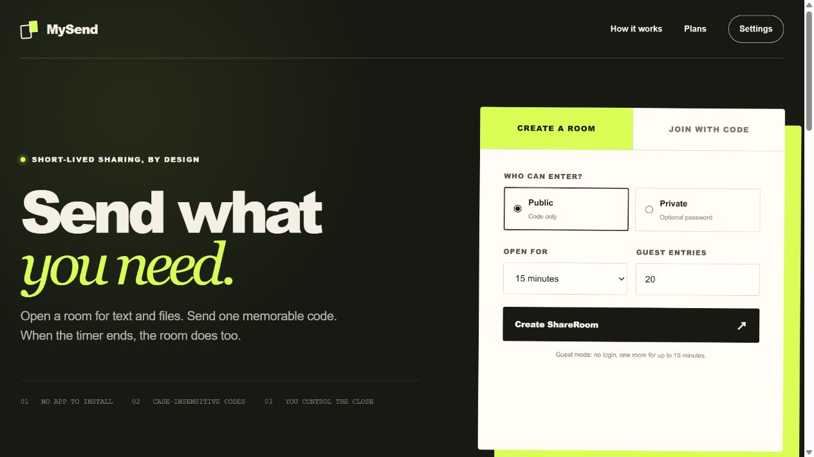
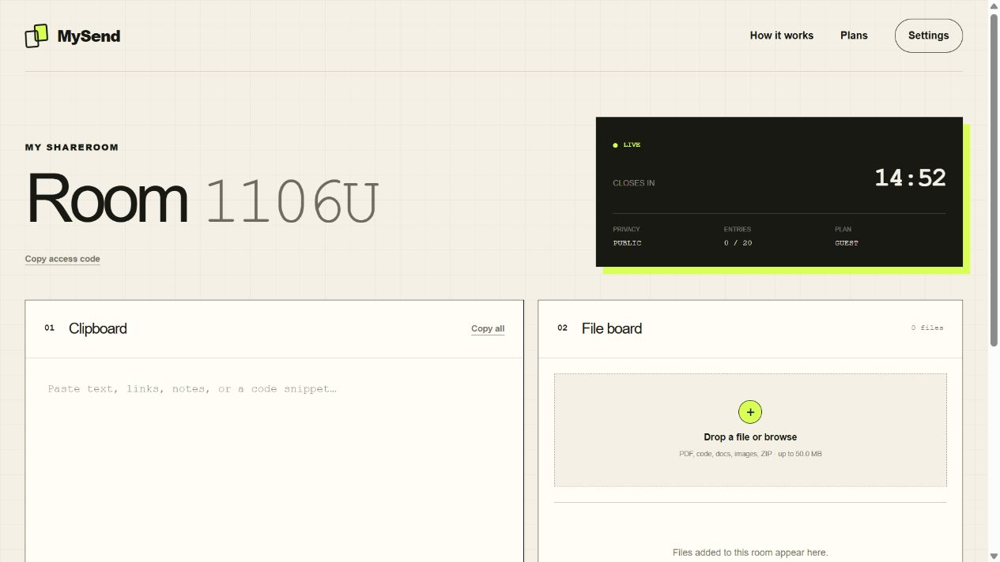
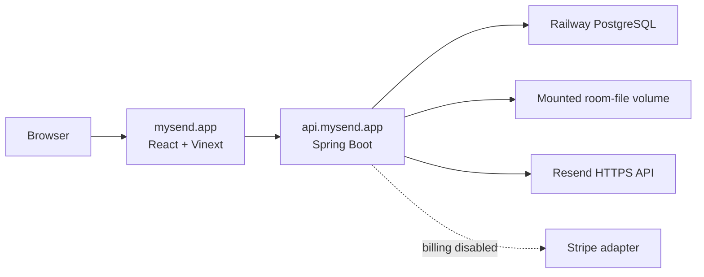

# MySend

**Send what you need. Keep nothing longer than necessary.**

[](https://github.com/alan746/MySend/actions/workflows/ci.yml)
[](https://mysend.app)

MySend is a production-deployed, full-stack workspace for sharing text and
files through temporary rooms. Guests can open a room without an account, send
one memorable five-character code, and let the room disappear when its timer
ends.

**[Open the live application →](https://mysend.app)**

<p align="center">
  <a href="https://mysend.app">
    
  </a>
</p>

## Engineering highlights

- **Lifecycle correctness:** closing, expiry, or entry exhaustion immediately
  blocks room access; retry-safe cleanup removes stored files before cascading
  database metadata and releases the room code only after successful deletion.
- **Security boundaries:** Spring Security, BCrypt, HttpOnly cookies, origin
  checks, rate limits, expiring email codes, and room-scoped authorization
  protect account and guest workflows.
- **Concurrent editing:** optimistic version checks prevent shared clipboard
  updates from silently overwriting newer content.
- **Production delivery:** the React web app and Spring Boot API ship as separate
  Docker services backed by PostgreSQL, Flyway migrations, persistent file
  storage, Resend email, health checks, and automated GitHub Actions validation.

## The product in one minute

1. **Create a room.** Choose public or private access, an optional password,
   the lifetime, and how many successful visitor entries to allow.
2. **Share one code.** MySend generates four digits followed by one letter,
   such as `4821K`. Uppercase and lowercase open the same room.
3. **Move text and files.** Everyone who successfully enters sees the same
   clipboard and file board; the owner keeps the policy and close controls.
4. **Leave no permanent workspace.** Closing, expiry, or exhausting the entry
   allowance immediately makes the room unavailable, then cleanup removes its
   retained content.

Guest creation and joining never require an account. Registration is optional
and adds a signed-in Dashboard, higher limits, account settings, and a list of
the member's active ShareRooms. Registering or signing in on the same proven
device atomically moves its still-open Guest rooms into that account without
changing their original plan limits or expiry.

## Product surfaces

| Surface | Live route | Purpose | Login required |
| --- | --- | --- | --- |
| Home | [mysend.app](https://mysend.app) | Guest creation, code entry, product explanation, and plan comparison | No |
| Dashboard | [mysend.app/dashboard](https://mysend.app/dashboard) | Member create/join actions, active rooms, and current plan limits | Yes |
| ShareRoom | `mysend.app/room/{code}` | Clipboard, file board, room status, and owner controls | Successful room entry |
| Account Settings | [mysend.app/settings](https://mysend.app/settings) | Email, membership, limits, active rooms, and password change | Yes |
| Password recovery | [mysend.app/forgot-password](https://mysend.app/forgot-password) | Request and redeem a single-use password code | No |

## What is available now

### Guest sharing

- create one ShareRoom without logging in;
- choose public or password-protected entry;
- join with a case-insensitive five-character code;
- share clipboard text and common documents, source code, images, JSON, and
  ZIP files;
- see the code, countdown, privacy, entry usage, and storage usage in the room;
- close the room immediately from the owner browser.

### Accounts

- register once per normalized email with a six-digit code that expires after
  ten minutes;
- receive branded security mail through the Resend HTTPS API;
- sign in without repeating email verification;
- recover a forgotten password with a single-use email code;
- change the password from Account Settings after another email-code check;
- use a signed-in Dashboard to create, join, and reopen active ShareRooms;
- review email, membership status, plan limits, and active rooms in Settings.

### Room workspace

- one shared clipboard with optimistic version checks to prevent silent
  overwrites;
- upload, list, download, and owner-delete file operations;
- per-plan clipboard, individual-file, total-file, lifetime, active-room, and
  visitor-entry limits;
- owner-only controls for privacy, password, entry allowance, close time, and
  immediate closure;
- secure room-scoped authorization that ends when the room closes.

<p align="center">
  
</p>

> **Premium status:** the Premium plan and its limits are presented in the
> product, but checkout and subscription management are temporarily disabled
> while billing is being updated. Guest and Free sharing are live.

## Plans and limits

Limits are captured when a room is created, so changing an account plan later
does not unexpectedly reshape an already-open room.

| Capability | Guest | Free account | Premium* |
| --- | ---: | ---: | ---: |
| Price | No login | CA$0 | CA$9.99/month |
| Active rooms | 1 | 2 | 5 |
| Maximum lifetime | 15 minutes | 60 minutes | 3 hours |
| Clipboard per room | 2,000 characters | 10,000 characters | 100,000 characters |
| Total files per room | 256 MiB | 1 GiB | 5 GiB |
| Maximum single file | 50 MiB | 250 MiB | 1 GiB |
| Successful visitor entries | 20 | 100 | 1,000 |

\* Premium purchasing is currently unavailable; the limits remain the defined
product target for the billing release.

## How the system is built



The web and API deploy independently from the same repository. The web never
talks directly to the database, file volume, Resend, or Stripe. Spring Boot
owns the room and account rules; PostgreSQL stores application state; the
mounted volume keeps accepted room files through API restarts until lifecycle
cleanup removes them. Closed, expired, and entry-exhausted rooms become purge
candidates before the 24-hour deadline; stored objects are deleted before their cascading
database metadata and access-code reservation. A storage error keeps the room
record reserved so the next cleanup pass can retry safely.

| Layer | Technology | Responsibility |
| --- | --- | --- |
| Web | React 19, Vinext (Next.js-compatible App Router), Vite, TypeScript, Tailwind CSS, Manrope | Server-rendered routes, responsive product UI, and typed API requests |
| API | Java 21, Spring Boot 3.5, Maven | Room, clipboard, file, account, security, email, and billing use cases |
| Data | PostgreSQL, H2, Flyway | Production persistence, local development, and ordered schema migrations |
| Storage | Local filesystem or mounted Railway volume | Temporary room files with plan quotas and expiry cleanup |
| Email | Resend HTTPS API | Registration, password reset, and password change codes |
| Security | Spring Security, BCrypt, HttpOnly cookies, origin checks, rate limits | Account sessions and room-scoped authorization |
| Delivery | Docker, Railway, GitHub Actions | Independent production images, health checks, and pull-request verification |
| Billing | Stripe adapter behind a disabled feature flag | Staged Premium checkout, portal, and webhook handling |

## Repository map

```text
app/                               web routes, components, API client, styles
backend/src/main/java/com/mysend/  Spring Boot product and adapter code
backend/src/main/resources/        configuration and Flyway migrations
backend/src/test/                  API, domain, security, and provider tests
docs/design/                       ordered product and system design
docs/images/                       README product screenshots
tests/                             rendered web-output checks
.github/workflows/                 CI for web, API, and both Docker images
Dockerfile                         production web image
backend/Dockerfile                 production API image
compose.yaml                       local API, PostgreSQL, and persistent volumes
```

## Run locally

### Requirements

- Node.js 22.13 or newer;
- Java 21 and Maven 3.9, or Docker Desktop;
- Git.

### 1. Start the API

The simplest full local stack uses PostgreSQL and the same API Dockerfile used
in production:

```bash
docker compose up --build --wait
```

This starts PostgreSQL and the API at `http://localhost:8080`. Local mail
delivery is disabled, so development verification codes are returned by the
API instead of being sent to a real inbox.

To run only the API with its default file-backed H2 database:

```bash
cd backend
mvn spring-boot:run
```

### 2. Start the web application

In another terminal, from the repository root:

```bash
npm ci
npm run dev
```

Open `http://localhost:3000`. The local API health endpoint is
`http://localhost:8080/actuator/health`.

### 3. Stop the container stack

```bash
docker compose down
```

This keeps the named PostgreSQL and upload volumes. Use an explicit volume
removal only when the local data is no longer needed.

## Verification

Run all web lint, type, build, and rendered-output checks:

```bash
npm run check
```

Run the complete Java test suite:

```bash
cd backend
mvn --batch-mode --no-transfer-progress verify
```

Build the same production images checked by CI:

```bash
docker build \
  --build-arg NEXT_PUBLIC_API_BASE_URL=https://api.mysend.app \
  --build-arg NEXT_PUBLIC_SITE_URL=https://mysend.app \
  --build-arg NEXT_PUBLIC_BILLING_ENABLED=false \
  --tag mysend-web .

docker build --tag mysend-api backend
```

Every pull request runs web checks, Java tests, and independent Docker builds
for both services before merge.

## Production

| Service | Railway root | Public address | Health check |
| --- | --- | --- | --- |
| Web | `/` | [https://mysend.app](https://mysend.app) | `/` |
| API | `/backend` | [https://api.mysend.app](https://api.mysend.app) | [Check API health](https://api.mysend.app/actuator/health) |

Production uses secure cookies, `https://mysend.app` as the allowed web origin,
Railway PostgreSQL, a volume mounted at `/app/uploads`, and Resend with a
verified sending domain. Both services deploy automatically from `main` after
the repository checks pass.

## Project documentation

- **Design process:** [Open the complete design sequence →](docs/design/README.md)
  — product problem, requirements, use cases, domain, architecture,
  interaction, interfaces, security, and decisions.
- **Development workflow:** [Open the repository workflow →](docs/development-workflow.md)
  — issue, branch, commit, pull-request, test, deployment, and release
  conventions.
- **Roadmap:** [Open planned updates →](docs/roadmap.md) — work beyond the
  current public release.

For the complete FR, QR, invariant, plan-limit, and acceptance-test baseline,
continue to the **[MySend requirements](docs/design/01-requirements.md)**.
