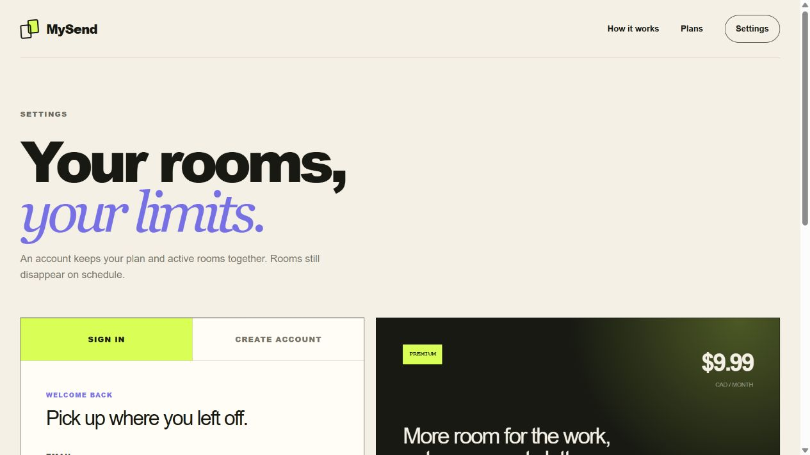
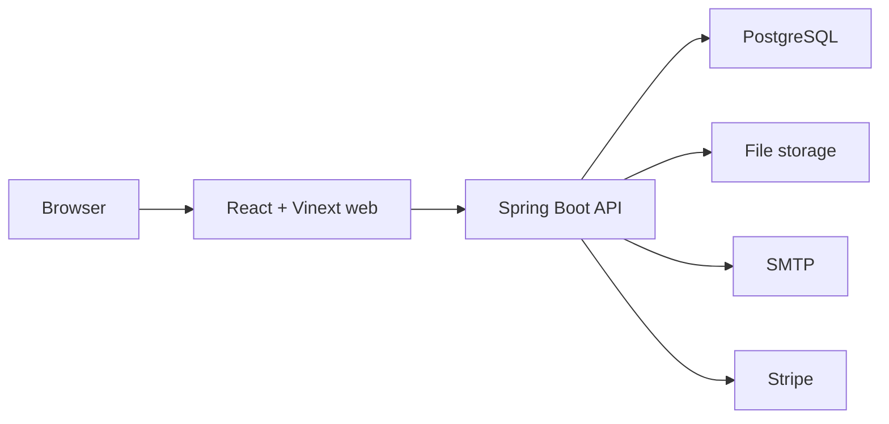

# MySend

**Send what you need. Keep nothing longer than necessary.**

MySend is a short-lived workspace for handing off text and files. Create a
ShareRoom without signing in, send one memorable five-character code, and let
the room close itself when the timer ends.

<p align="center">
  
</p>

## What it does

- **Create in seconds.** Choose a public or password-protected room, its
  lifetime, and the number of successful entries allowed.
- **Join with one code.** Every room gets four digits and one letter. Codes are
  case-insensitive, so `4821K` and `4821k` open the same room.
- **Share text and files together.** The clipboard and file board sit side by
  side, with no folder setup or permanent storage to manage.
- **See every limit.** The room shows its remaining time, privacy, entry count,
  plan, character use, and file storage at a glance.
- **Stay anonymous when you want.** Guest creation and joining require no
  account. Free registration adds My ShareRooms; Premium raises every limit.

| ShareRoom workspace | Account and plans |
| --- | --- |
|  |  |

## Current capabilities

The current build covers the complete temporary-sharing flow:

- public and private ShareRooms with optional passwords;
- case-insensitive access codes in a readable `0000A` format;
- access-count enforcement after a successful room entry;
- shared clipboard updates with plan-specific character limits;
- upload, download, listing, and deletion for common documents, source code,
  images, archives, and other files;
- owner controls for password, privacy, entry limit, close time, and immediate
  room closure;
- email registration with a ten-minute verification code, sign-in sessions,
  and an active My ShareRooms list;
- Stripe checkout, customer billing portal, and subscription webhooks;
- automatic expiry cleanup, API rate limits, secure room cookies, and
  production configuration checks.

## Plans and limits

| Capability | Guest | Free account | Premium |
| --- | ---: | ---: | ---: |
| Monthly price | No login | $0 | $9.99 CAD |
| Active rooms | 1 | 2 | 5 |
| Maximum lifetime | 15 minutes | 60 minutes | 3 hours |
| Clipboard per room | 2,000 characters | 10,000 characters | 100,000 characters |
| Total files per room | 250 MB | 1 GB | 5 GB |
| Single file | 50 MB | 250 MB | 1 GB |
| Successful entries | 20 | 100 | 1,000 |

## Technology

| Layer | Technology | Role |
| --- | --- | --- |
| Web | React 19, TypeScript, Vinext, Vite, Tailwind CSS | Server-rendered routes, responsive interface, and typed API client |
| API | Java 21, Spring Boot 3, Maven | Room, account, file, email, and billing services |
| Data | PostgreSQL, H2, Flyway | Production persistence, lightweight local profile, and schema migrations |
| Storage | Local or mounted file storage | Expiring room uploads with per-plan quotas |
| Integrations | SMTP, Stripe | Email verification and Premium subscriptions |
| Delivery | Docker Compose, GitHub Actions | Reproducible local services and pull-request checks |



## Run locally

The web client requires Node.js 22 or newer. The API requires Java 21, or it
can run with PostgreSQL through Docker Desktop.

```bash
npm ci
npm run dev
```

In another terminal:

```bash
cd backend
mvn spring-boot:run
```

For the containerized API and PostgreSQL instead:

```bash
docker compose up --build
```

Open `http://localhost:3000`; the API health endpoint is
`http://localhost:8080/actuator/health`.

## Project documents

- [Design process](docs/design/README.md) — principles, requirements, use
  cases, domain model, Clean Architecture, sequences, interfaces, security,
  and operations in their required design order.
- [Development workflow](docs/development-workflow.md) — repository layout,
  issue-to-release process, local checks, and production delivery.
- [Roadmap](docs/roadmap.md) — launch work and the updates planned after the
  first public release.
