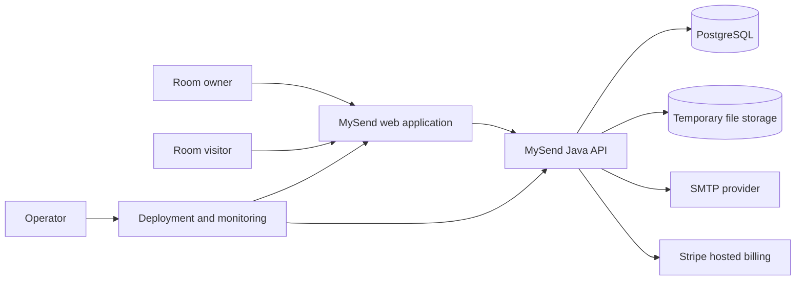

# 0. Design brief

**Status: Baseline — approved before implementation**

## Purpose of this document

This brief fixes the initial product and system direction before detailed UI,
API, or database work begins. Later documents expand these decisions; they do
not redefine the product from the convenience of an implementation framework.

## Problem statement

People regularly need to move a short piece of text or a few files between
devices or people. Permanent drives add accounts and organization, chat retains
history, and email requires recipients. The missing experience is a temporary,
neutral handoff space that can be opened and joined in seconds.

## Product outcome

A person creates a short-lived ShareRoom, sends one memorable access code, and
both sides use the same clipboard and file board until time, entry count, or
the owner closes the room.

Success means:

- a first-time visitor can create or join without registering;
- the access code can be read aloud and typed on another device;
- room lifetime, privacy, entries, and capacity are visible;
- closed content becomes inaccessible immediately and is physically removed
  within the retention objective;
- registration and payment add continuity or capacity without changing the
  core sharing model.

## Actors and primary journeys

| Actor | Primary journey |
| --- | --- |
| Guest owner | Open site → create public/private room → share code → use workspace → close or allow expiry |
| Visitor | Open site → enter code → provide password if requested → use workspace → leave |
| Returning member | Sign in → view active rooms → create with Free/Premium limits → manage room |
| New member | Enter email/password → verify six-digit code → continue as Free member |
| Premium member | Open Settings → Stripe checkout/portal → return with plan synchronized by webhook |
| Operator | Deploy, monitor capacity and purge lag, respond to storage/mail/billing failures |

## Experience decision

MySend uses three primary pages rather than a dashboard hierarchy:

1. **Home** — product promise plus Create/Join task switcher.
2. **ShareRoom** — code/status, clipboard, file board, and owner controls.
3. **Settings** — authentication, My ShareRooms, plan comparison, and billing.

Create and Join remain accessible without an account. Settings is a supporting
route, not a gate placed in front of the product.

## System context

## Architecture decisions

| Decision | Choice | Reason | Rejected alternative |
| --- | --- | --- | --- |
| Delivery shape | Responsive web application | Opens from any device without installation | Native apps would add distribution friction before product validation. |
| Web | React + TypeScript with server-rendered routes | Strong component model, typed contracts, fast first page | A Java-rendered UI would couple page iteration to backend delivery. |
| API | Java 21, Spring Boot, Maven | Clear validation/security ecosystem and requested Java/Maven backend | Python is faster for a prototype but less aligned with the intended long-term backend. |
| Service topology | Modular monolith | One deployable API keeps transactions and operations simple at launch | Microservices introduce network failure and deployment overhead without independent scale needs. |
| Architecture style | Clean Architecture dependency rule | Keeps room/account policy independent of Spring, Stripe, SMTP, and storage | Controller-service-repository without ports would let framework decisions own business policy. |
| Database | PostgreSQL + Flyway | Atomic entry consumption, unique codes/emails, version checks, durable migrations | In-memory-only state cannot survive deployment or coordinate instances. |
| File storage | Storage port; mounted adapter for preview, object-storage adapter for production | Room lifecycle can control storage without coupling policy to a filesystem | Storing large files in PostgreSQL complicates backup and streaming. |
| Browser identity | HTTP-only device, account, and room-scoped cookies | Supports no-login ownership while keeping opaque tokens out of JavaScript | Local-storage bearer tokens increase exposure to injected scripts. |
| Access code | Four digits + readable letter, case-insensitive | Short enough to say and type; 240,000 combinations with `I`/`O` omitted | Long random links are less useful for device-to-device transfer. |
| Registration | Email/password plus ten-minute code | Proves email ownership once without making every room require login | Social login adds providers and privacy decisions before it is needed. |
| Billing | Stripe-hosted checkout and portal | MySend never processes card data; subscription state arrives by signed webhook | Custom card forms greatly increase compliance and security scope. |

## Data and lifecycle decisions

- A room stores a plan snapshot when created. A later upgrade/downgrade affects
  new rooms; an open room finishes under its original limit for at most three
  hours.
- Manual close, expiry, or entry exhaustion denies access immediately.
- Clipboard text, filenames, file objects, and reusable access-code reservation
  are removed within 24 hours after logical closure.
- Expired tokens and verification/session data are removed independently of
  room content.
- Successful registration or login on a device claims its still-open Guest
  rooms into that account. The claim requires both the device owner proof and
  the authenticated account session.
- My ShareRooms lists only logically open account-owned rooms.
- Visitors remain anonymous to the room owner; the system stores authorization
  tokens, not visitor profiles.

## Capacity assumptions

The initial access-code pool is 240,000. With a 24-hour purge objective, alert
at 25% retained occupancy and block public growth work at 50% until the code
strategy is reviewed. File and database capacity are protected by per-plan
quotas plus deployment-level rate and storage alarms.

The service starts as one API instance for private preview. Public launch must
support a managed PostgreSQL database, durable shared/object storage, HTTPS,
health probes, backups, and observable cleanup before horizontal API scaling.

## Design risks resolved before coding

| Risk | Design response |
| --- | --- |
| Code guessing | Optional private password, entry limits, attempt throttling, identical unavailable response |
| Access-code exhaustion | Readable alphabet, occupancy monitoring, 24-hour purge objective, future format review gate |
| Concurrent edits | Versioned optimistic updates with explicit conflict recovery |
| Upload abuse | Extension/type policy, per-file/room quotas, malware quarantine before public launch |
| Lost Guest ownership after login | Atomic device-to-account claim of open rooms |
| Payment redirect spoofing | Only signed, idempotent Stripe webhooks change plan |
| Cleanup/storage mismatch | Delete content through a storage port; retry/compensate before releasing metadata/code |

## Approval gate

Before implementation begins, reviewers must agree that:

- the three-page interaction model completes all primary journeys;
- Guest sharing is complete without authentication;
- chosen limits and 24-hour purge objective are operationally affordable;
- the modular-monolith boundaries can express UC-01 through UC-10;
- external providers remain adapters rather than domain dependencies;
- public-launch security and storage work is explicitly scoped rather than
  hidden behind local defaults.
