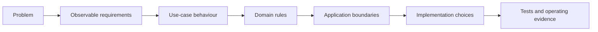

# 0. Design brief and principles

**Status: Baseline - approved before requirements and solution design**

## Purpose

This brief fixes the problem, product outcome, scope, and governing principles.
It deliberately stops before choosing controllers, tables, frameworks, or
provider adapters. Those choices are derived only after the requirements, use
cases, and domain rules are understood.

The design process is:

## Problem statement

Moving a short piece of text or a few files between devices or people often
takes more setup than the content deserves. Permanent drives introduce
accounts, folders, and long-term organization. Chat retains history and
requires a conversation. Email requires a recipient. MySend serves the
temporary handoff between those products.

## Product promise

> Send what you need through one short-lived ShareRoom, without requiring an
> account, and make its access and disappearance easy to understand.

A person creates a ShareRoom, shares one memorable code, and both sides use
the same clipboard and file board until the owner closes the room, its time
runs out, or its successful-entry allowance is exhausted.

## Product outcomes

MySend succeeds when:

- a first-time visitor creates or joins a room without registration;
- the access code can be read aloud and typed on another device;
- public/private access and any room password behave predictably;
- owners and participants see the same room status and capacity;
- closed content becomes unavailable immediately and is later removed;
- registration adds cross-device continuity and Free capacity;
- Premium adds capacity through hosted billing without changing the sharing
  protocol.

## Actors and primary journeys

| Actor | Primary journey |
| --- | --- |
| Guest owner | Open MySend -> configure public/private room -> create -> share code -> use workspace -> close or allow expiry |
| Visitor | Open MySend -> submit code -> submit password only when required -> use clipboard/files -> leave |
| New member | Open Settings -> submit email/password -> enter ten-minute code -> continue as a signed-in Free member |
| Returning member | Sign in with email/password -> view My ShareRooms -> create or manage active rooms |
| Premium member | Compare limits -> use hosted checkout or billing management -> continue after plan synchronization |
| Operator | Deploy safely -> watch capacity and purge deadlines -> recover storage, mail, billing, or database failure |

## Experience boundary

MySend has three primary destinations:

1. **Home** - product promise plus Create and Join tasks.
2. **ShareRoom** - room code/status, clipboard, file board, and owner controls.
3. **Settings** - registration/login, My ShareRooms, plan comparison, and
   billing actions.

Create and Join are complete without an account. Settings supports continuity
and membership; it is never a gate in front of the core product.

## Governing principles

### P1. No-login sharing is a complete path

A guest can create, enter, use, and close a ShareRoom. Registration may add
continuity and capacity but cannot unlock the basic act of sharing.

### P2. Temporary is the default

Every room receives an expiry when it is created. Manual closure, time expiry,
or exhausted successful entries makes the room unusable immediately. Content,
credentials, and code reservation follow the room lifecycle.

### P3. One memorable locator

The primary handoff is one five-character code: four digits and one readable
letter. Input is case-insensitive. Links or QR codes may be added later, but
the code remains sufficient by itself.

### P4. Limits are visible before they become errors

Lifetime, entries, clipboard capacity, file capacity, privacy, and plan appear
where the user makes the related decision. The authoritative policy is shared
across every interface, and invalid choices fail without partial work.

### P5. Owners control policy; participants share content

Only an owner changes privacy, password, lifetime, entry limit, or closure and
deletes room files. An entered visitor can use the clipboard and file board
but cannot change room policy. The owner does not receive a visitor profile.

### P6. One room has two workspace surfaces

Clipboard and file board share one room identity, authorization, countdown,
and quota context. They are two parts of one handoff rather than separate
products.

### P7. Payment buys capacity, not correctness

Guest, Free, and Premium use the same authorization, consistency, and sharing
rules. Higher plans increase capacity; they do not receive a safer or more
reliable protocol.

### P8. Friction matches risk

Public rooms use the access code. Private rooms may add a password. Account
registration proves email ownership once; ordinary login does not repeat the
email-code step. Sensitive failures disclose no more information than the
actor needs to recover.

### P9. Concurrent changes fail explicitly

One accepted entry consumes one allowance. Stale content or policy changes do
not silently overwrite a newer change. The user receives a clear refresh or
retry action.

### P10. Operational simplicity does not imitate production safety

The product may begin as one small deployable system, but a public release
still requires durable data, secure transport, secret handling, abuse
controls, observable cleanup, and tested recovery.

## Fixed product policy

The detailed and testable values live in [1. Requirements
baseline](01-requirements.md). At inception:

- Guest is complete but intentionally smallest: one active room and at most
  fifteen minutes;
- a verified account begins on Free and can see My ShareRooms;
- Free supports two active rooms and at most one hour;
- Premium costs CA$9.99 monthly, supports five active rooms, and at most three
  hours;
- every plan has explicit clipboard, single-file, total-file, and successful
  entry limits;
- registration codes expire after ten minutes;
- closed room content has a 24-hour physical purge objective.

These are product decisions. Later design chooses mechanisms that satisfy them.

## Scope

### In scope

- guest, Free, and Premium room creation;
- public and private code-based entry;
- one shared clipboard and one shared file board;
- owner policy management and immediate close;
- registration, email verification, login/logout, and My ShareRooms;
- hosted Premium checkout and billing management;
- logical closure, physical cleanup, monitoring, and recovery.

### Out of scope

MySend is not initially:

- a permanent cloud drive, backup system, or version history;
- a real-time rich-text or source-code collaboration editor;
- a public directory or search engine for rooms;
- a social graph, messaging system, or visitor analytics product;
- a native mobile or desktop application;
- a card-data processor or custom payment form;
- a guarantee that any uploaded file is harmless.

## Initial assumptions to validate

| Assumption | Evidence required before public launch |
| --- | --- |
| A five-character pool supports early traffic | Retained-code occupancy and creation collision measurements stay below the review threshold. |
| Fifteen minutes is useful for Guest handoffs | Private-preview completion and abandonment feedback supports the value. |
| Clipboard plus files covers the core handoff | Usability sessions complete representative text, code, image, and document transfers without another feature. |
| Optional private password is understandable | Users correctly predict whether a chosen room needs only a code or a code and password. |
| Twenty-four-hour purge is operationally achievable | Cleanup-lag evidence includes provider failures and retry, not only the normal path. |
| Hosted billing is acceptable | Sandbox testing covers checkout, return, webhook delay, cancellation, and billing management. |

An invalidated assumption starts a requirement change. It does not permit a
downstream implementation to redefine the product silently.

## Open product questions

The following do not block the first private preview but must be decided before
their affected public-launch work:

- whether private rooms without passwords should remain supported after
  usability testing;
- the public-launch entry/password abuse thresholds;
- the reference environment used for the performance requirement;
- malware quarantine and archive-inspection policy;
- account deletion and long-term billing-event retention policy;
- the access-code format or reuse policy at the capacity review threshold.

## Approval gate

The brief is ready for requirements work when reviewers agree that:

- the no-login handoff is the primary product rather than an account teaser;
- temporary room lifecycle is part of the product promise;
- the three-destination experience completes every primary journey;
- membership changes capacity and continuity, not the sharing protocol;
- non-goals prevent permanent-storage and social-product scope creep;
- disputed product behaviour is listed as an open question instead of hidden
  inside technical design.
