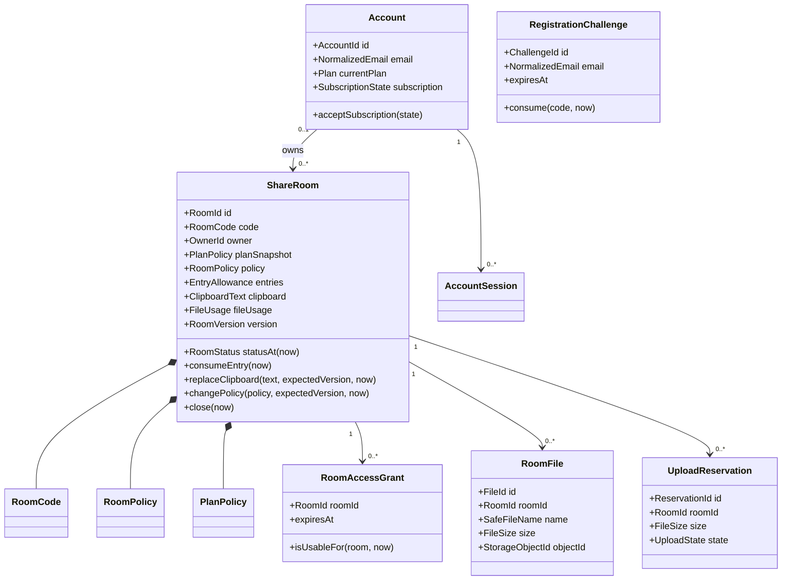
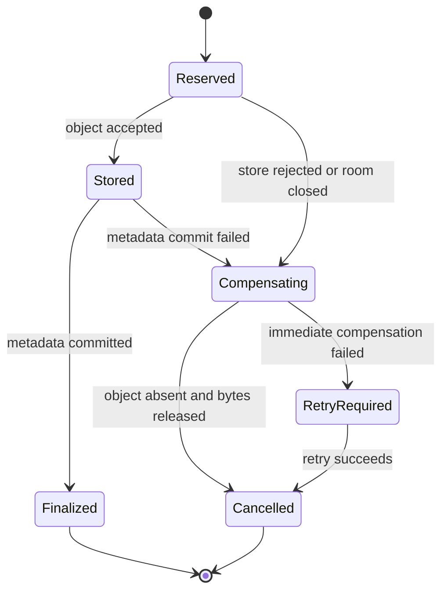

# 3. Domain model

**Status: Baseline - domain concepts approved before persistence design**

## Purpose and requirement scope

This model gives one owner to every business invariant in [1. Requirements
baseline](01-requirements.md) and provides the concepts used by [2. Use
cases](02-use-cases.md). It does not mirror database rows. A persistence model
may flatten these concepts, but it cannot become the source of their rules.

The model primarily serves FR-01-FR-28, QR-01-QR-02, QR-09-QR-11, and
INV-01-INV-12.

## Modeling rules

- An **entity** has an identity that matters while its attributes change.
- A **value object** is interchangeable with another instance of the same
  valid value and prevents invalid values from entering the model.
- A **domain policy/service** owns a rule that belongs to the domain but does
  not naturally belong to one entity or value object.
- An **application process** coordinates domain objects and external effects;
  it is not promoted to a domain entity merely because it has code.

## Ubiquitous language

| Term | Meaning |
| --- | --- |
| ShareRoom | A time- and entry-bounded workspace with one clipboard and one file board |
| Owner | A device or account identity allowed to manage one room |
| Participant | The owner or a visitor with a valid grant for that room |
| Successful entry | One accepted code/password exchange that consumes one allowance and creates one grant |
| Plan snapshot | Guest, Free, or Premium capacity captured by a room at creation |
| Room policy | Visibility, optional password protection, lifetime, and successful-entry limit |
| Logical closure | Immediate unavailability caused by manual close, time expiry, or entry exhaustion |
| Physical purge | Later removal of stored content, credentials, metadata, and code reservation |
| Compensation | Work that restores quota/storage consistency after a cross-boundary file failure |

## Concept classification

### Entities

| Entity | Why identity matters | Mutable state it owns |
| --- | --- | --- |
| `ShareRoom` | It remains the same handoff as clipboard, entries, files, policy, or status change. | Clipboard, policy, entry count, file usage, version, closure |
| `Account` | It remains the same membership while plan and billing state change. | Plan, accepted subscription state, billing reference |
| `RoomFile` | A specific accepted upload must be listed, downloaded, deleted, and purged once. | Storage disposition and deletion state |
| `RoomAccessGrant` | One issued visitor authorization can expire or be revoked independently. | Expiry/revocation status |
| `RegistrationChallenge` | A particular email challenge can expire, fail attempts, or be consumed once. | Attempt count and consumption |
| `AccountSession` | One login session can be used and revoked independently. | Expiry/revocation status |
| `UploadReservation` | A cross-storage upload needs one identity for finalize or compensation. | Reserved, stored, finalized, compensating, completed |

### Value objects

| Value object | Validity and behaviour |
| --- | --- |
| `RoomCode` | Exactly four digits plus one readable uppercase letter; trims and canonicalizes case at construction |
| `OwnerId` | Names either one device owner or one account owner without exposing a browser token |
| `RoomLifetime` | At least five minutes and no greater than the selected plan policy |
| `EntryAllowance` | Positive configured limit plus a non-negative consumed count that never exceeds it |
| `RoomVisibility` | `PUBLIC` or `PRIVATE`; password protection is meaningful only with `PRIVATE` |
| `PlanPolicy` | Immutable Guest, Free, or Premium capacity used to validate one room |
| `RoomVersion` | Monotonically increasing concurrency value |
| `ClipboardText` | Unicode text whose character count fits the room plan |
| `FileUsage` | Non-negative single and aggregate byte quantities bounded by plan policy |
| `NormalizedEmail` | Trimmed, canonical account identifier used for uniqueness |
| `SubscriptionState` | Provider event time/order plus the Free/Premium entitlement it implies |
| `PurgeDeadline` | Logical-closure time plus the approved physical-retention objective |

### Domain policies and application processes

| Concept | Classification | Reason |
| --- | --- | --- |
| `RoomEntryPolicy` | Domain policy | Determines password/open/capacity acceptance and the state change required for one successful entry. |
| `GuestRoomClaimPolicy` | Domain policy | Decides whether proven device ownership permits reassignment to an authenticated account. |
| `SubscriptionTransitionPolicy` | Domain policy | Accepts only authentic, new, causally current subscription state. |
| `RoomPurgePolicy` | Domain policy | Determines logical closure cause and purge eligibility/deadline. |
| `CreateRoom` | Application process | Coordinates owner resolution, code generation, time, and room persistence around domain construction. |
| `UploadRoomFile` | Application process | Coordinates a reservation, object storage, metadata, and compensation. |

## Conceptual model

This is a business model. Protected credential representations and provider
identifiers appear at application/security boundaries; they are not public
properties of these concepts.

## Aggregate boundaries

### ShareRoom aggregate

`ShareRoom` is the consistency boundary for room policy, plan snapshot,
successful entries, clipboard, file-byte usage, lifecycle, and version.

Operations on the aggregate require an explicit current time and actor/capacity
input where needed. The aggregate does not read the system clock, database, or
browser itself.

Rules:

- construction requires a valid `RoomCode`, `OwnerId`, `PlanPolicy`, and
  `RoomPolicy`;
- owner access does not consume visitor entries;
- one successful visitor entry changes count and grant state as one result;
- every protected content/policy operation checks logical open state;
- clipboard and policy mutations compare and advance `RoomVersion`;
- file bytes are reserved before an external store is asked to accept content;
- the plan snapshot never changes after construction.

### Account aggregate

`Account` owns normalized email identity, current plan, and the newest accepted
subscription state. A newly verified account starts on Free. Account sessions
and registration challenges are separate credential entities so their
revocation/expiry does not change account identity.

### File consistency boundary

File bytes live outside the ShareRoom aggregate, so `UploadReservation` makes
the cross-boundary state explicit:

A finalized file has metadata, object, and accounted bytes. A non-finalized
reservation is either fully cancelled or remains discoverable for retry.

## Invariant ownership

| Invariant | Authoritative owner | Enforcement responsibility |
| --- | --- | --- |
| INV-01 | `RoomCode` plus code allocation policy | Canonical form is created once; allocation refuses a retained duplicate. |
| INV-02 | `RoomEntryPolicy` | Failure produces neither entry transition nor authorization grant. |
| INV-03 | `ShareRoom.EntryAllowance` | Conditional consumption refuses a count at the limit, including concurrent attempts. |
| INV-04 | `ShareRoom` lifecycle | `statusAt(now)` gates every protected operation and no transition returns to Open. |
| INV-05 | `RoomAccessGrant` | Grant contains one room identity and expiry no later than that room. |
| INV-06 | `PlanPolicy` validated by `ShareRoom` | All room policy/content counters remain within the immutable snapshot. |
| INV-07 | `ShareRoom` ownership policy | Policy, close, and delete commands require the matching `OwnerId`. |
| INV-08 | `ShareRoom.planSnapshot` | Snapshot has no mutation after room construction. |
| INV-09 | `Account` plus account identity policy | One normalized email creates at most one account; verified creation selects Free. |
| INV-10 | `SubscriptionTransitionPolicy` | Authenticity, event identity, and causal order are required before transition. |
| INV-11 | `UploadReservation` | Finalize or compensate keeps metadata, object, and byte accounting consistent/recoverable. |
| INV-12 | `GuestRoomClaimPolicy` | Both authenticated account and matching device-owner proof are required for an open room. |

No invariant is owned by a controller, table, scheduled annotation, or UI
component. An adapter can add an atomic constraint that protects an invariant,
but the invariant exists independently of that mechanism.

## ShareRoom lifecycle

```mermaid
stateDiagram-v2
    [*] --> Open: created
    Open --> ManuallyClosed: owner closes
    Open --> Expired: now reaches expiresAt
    Open --> Exhausted: successful entries reach limit
    ManuallyClosed --> PurgeEligible: retention policy
    Expired --> PurgeEligible: retention policy
    Exhausted --> PurgeEligible: retention policy
    PurgeEligible --> Purged: every file and record removed
    PurgeEligible --> PurgeEligible: deletion failure; retry
    Purged --> [*]
```

`ManuallyClosed`, `Expired`, and `Exhausted` have different causes but one
authorization result: unavailable. The cause remains useful for owner feedback
and operations without being disclosed to an untrusted code guesser.

## Plan policies

| Plan | Active rooms | Lifetime | Clipboard | Room files | Single file | Entries |
| --- | ---: | ---: | ---: | ---: | ---: | ---: |
| Guest | 1 | 5-15 min | 2,000 chars | 256 MiB | 50 MiB | 20 |
| Free | 2 | 5-60 min | 10,000 chars | 1 GiB | 250 MiB | 100 |
| Premium | 5 | 5-180 min | 100,000 chars | 5 GiB | 1 GiB | 1,000 |

The table is repeated from the requirements because `PlanPolicy` owns its
validation in the domain. A plan change changes the policy for new rooms only.

## Access-code capacity model

`RoomCode` uses 10,000 numeric prefixes and 24 letters, for 240,000 canonical
values. A value remains allocated until the room is physically purged.

Retained occupancy is approximately rooms created during the purge horizon
plus cleanup retries. Operations review is required at 25% occupancy (60,000
codes), and unreviewed traffic growth stops at 50% (120,000 codes). Before that
point, a requirement decision must shorten reservation retention, separate
content purge from code reuse, or enlarge the human-readable format.

## Domain events

The model emits facts after accepted state changes:

- `RoomCreated`
- `RoomEntered`
- `ClipboardUpdated`
- `RoomPolicyChanged`
- `RoomClosed`
- `FileUploadReserved`, `FileUploadFinalized`, `FileCompensationRequired`
- `AccountVerified`, `GuestRoomsClaimed`
- `SubscriptionStateAccepted`
- `RoomPurgeRequired`, `RoomPurged`

These events allow interface feedback, cleanup, and observability without
placing those adapters inside the entity.

## Persistence translation, not persistence design

| Domain concept | Minimum durable representation | Important translation rule |
| --- | --- | --- |
| ShareRoom | Identity, canonical code, owner, policy, snapshot, counts, content, lifecycle time, version | Rehydrate through a factory that revalidates structure without replaying creation policy. |
| RoomAccessGrant | Room identity, protected credential representation, expiry/revocation | Plain grant value is never reconstructed from storage. |
| RoomFile | Room-scoped metadata and generated object identity | Client filename is display data, never a storage locator. |
| UploadReservation | Reservation identity, room, bytes, state, retry evidence | Incomplete states remain queryable for compensation. |
| Account | Identity, normalized email, protected password representation, plan, subscription order | Email uniqueness protects INV-09 but does not define it. |
| Registration/session | Protected credential representation, scope, expiry, consumption/revocation | Expired values cannot authorize even before physical cleanup. |

## Domain approval gate

The domain is ready for architecture design when:

- entities and value objects are classified by identity and invariants;
- INV-01 through INV-12 each have exactly one authoritative owner;
- ShareRoom rules can execute with supplied time and ports, without HTTP,
  Spring, SQL, storage, mail, or billing types;
- file compensation is represented as durable business state;
- logical closure is independent from the cleanup scheduler;
- persistence can translate the model without becoming the source of a rule.
