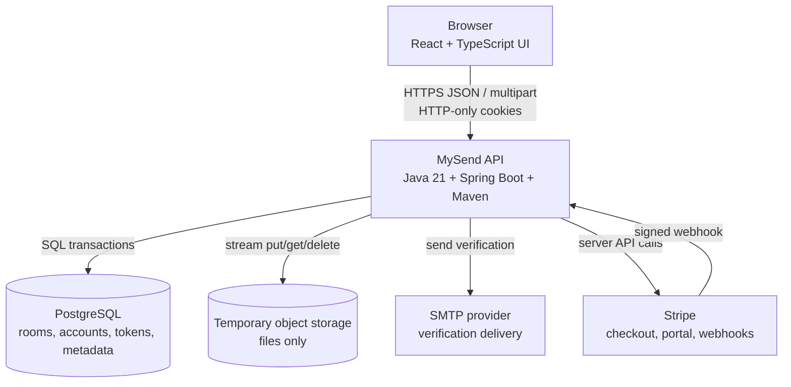
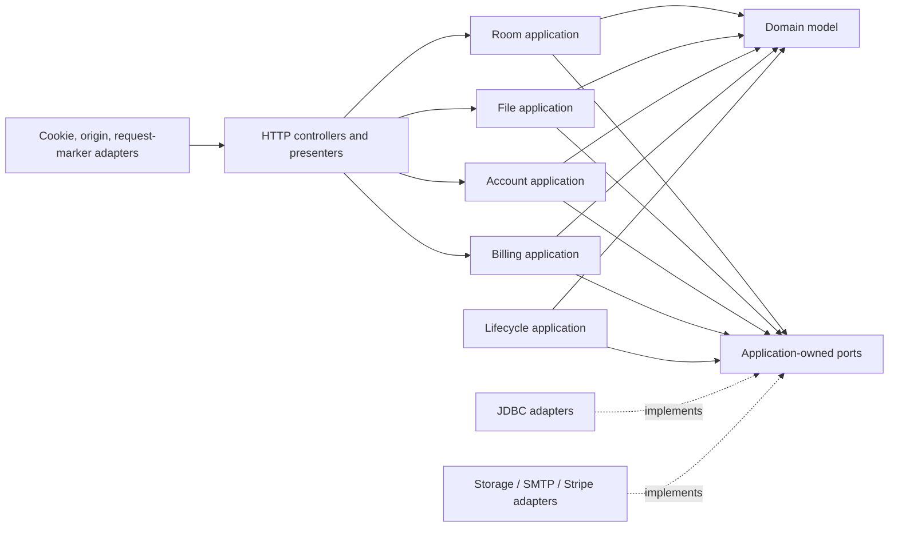
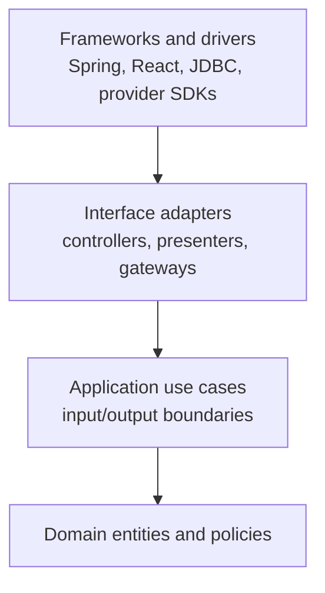
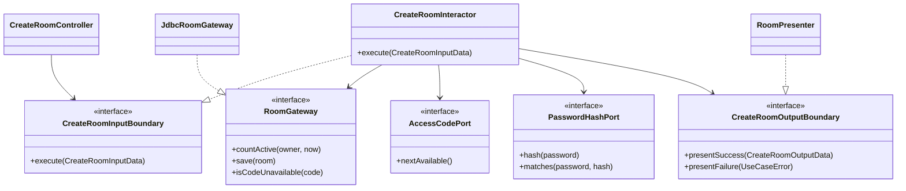

# 4. System architecture

**Status: Baseline — selected before application implementation**

## Design inputs

The architecture implements the behaviour in [2. Use cases](02-use-cases.md)
and protects the invariant owners in [3. Domain model](03-domain-model.md).
Requirements describe why a boundary exists; technology is selected only
after that boundary is named. Major choices and their trade-offs are recorded
separately in [9. Architecture decision records](09-architecture-decisions.md).

## Architecture drivers

The architecture must support:

- complete Guest sharing without an account gate (FR-01, FR-05);
- atomic room entry and optimistic clipboard/settings changes (QR-01, QR-02,
  INV-02-INV-03);
- room-scoped authorization and immediate logical closure (FR-09, FR-27,
  INV-04-INV-05);
- streamed file transfer, quota reservation, and compensation (FR-15-FR-17,
  QR-04, INV-11);
- mail and hosted billing integrations behind stable boundaries (FR-18,
  FR-24-FR-26);
- physical purge with deadline evidence and retry (FR-28, QR-10);
- one small-team deployment at launch without preventing later horizontal API
  scaling (QR-13);
- fast isolated tests for business policy (QR-11).

These drivers favor a modular monolith with Clean Architecture boundaries over
microservices or framework-centered controller logic.

## Container architecture



### Web container

Owns presentation, local form state, countdown display, responsive composition,
and mapping API problems to user feedback. It does not decide whether an entry
is available, whether a room is open, or which plan limit applies.

### API container

Owns application use cases, domain invariants, authorization, provider
coordination, persistence transactions, cleanup, and stable external contracts.
It is one deployable process divided into modules, not one undifferentiated
service class.

### PostgreSQL

Owns transactional records and uniqueness. Entry consumption, access-code and
email uniqueness, file-byte reservation, version checks, and webhook event
claims rely on database predicates rather than in-process locks.

### Temporary storage

Owns file bytes addressed only by generated storage keys. The domain sees a
storage port. A mounted-directory adapter is allowed for local/private preview;
public deployment uses durable S3-compatible object storage and cleanup retry.

## API component architecture



| Component | Use cases and requirements | Responsibility | Must not own |
| --- | --- | --- | --- |
| Room application | UC-01-UC-04, UC-06; FR-01-FR-14 | Create, enter, authorize, clipboard, settings, close | HTTP cookies, SQL syntax, page state |
| File application | UC-05; FR-15-FR-17, INV-11 | File policy, quota reservation, metadata coordination, deletion compensation | Multipart parsing, filesystem paths, vendor SDK types |
| Account application | UC-07-UC-08; FR-18-FR-23, INV-12 | Verification, registration, login/logout, Guest-room claim, My ShareRooms | SMTP transport, servlet requests |
| Billing application | UC-09; FR-24-FR-26, INV-10 | Checkout/portal intent and subscription-to-plan policy | Stripe JSON/HTTP details, browser redirect success claims |
| Lifecycle application | UC-10; FR-27-FR-28, QR-10 | Logical expiry checks, credential cleanup, content purge orchestration | Scheduler framework annotations, provider-specific delete calls |
| Domain model | INV-01-INV-12 | Room/account/file values, plan limits, lifecycle and invariants | Time lookup, environment, database, network |

## Clean Architecture dependency rule



Runtime calls can travel outward through interfaces, but source dependencies
point inward. The application layer owns each required port; an outer adapter
implements it.

## Use-case boundary pattern

The following example is the application shape derived from UC-01. The names
are a proposal, not a requirement to predict every eventual class.



Transport validation answers “is the request shaped correctly?” The interactor
answers “is this operation allowed for this actor, plan, and state?” Domain
objects preserve invariant-valid state. Output boundaries return product
results and stable errors; an HTTP presenter selects status, JSON, cookies,
and headers.

## Validation and decision ownership

| Decision | Owner | Example |
| --- | --- | --- |
| Request shape | Input adapter | Required JSON field is absent or a multipart part is unreadable. |
| Value validity | Value object | A `RoomCode` cannot represent the wrong shape or case. |
| Business permission/policy | Use case and domain owner | A visitor cannot change room policy; a lifetime cannot exceed the snapshot. |
| Atomic consistency | Gateway adapter under application contract | Final entry, expected version, unique code/email, and event claim. |
| External translation | Output/provider adapter | Map a use-case failure to HTTP or a provider payload to a billing event. |
| Presentation recovery | Web interface | Preserve form data, explain refresh, or replace the workspace after closure. |

## Port catalogue

| Application | Required ports owned by the application layer | Main use cases |
| --- | --- | --- |
| Room | room gateway, code generator, password protection, clock, owner identity, room-grant issuer | UC-01-UC-04, UC-06 |
| File | room authorization, reservation/file metadata gateway, object storage, malware scan/quarantine, clock | UC-05 |
| Account | account, challenge, attempt, session and Guest-room-claim gateways; password protection; mail; clock | UC-07-UC-08 |
| Billing | hosted billing provider, account gateway, event-claim gateway, event-authentication port, clock | UC-09 |
| Lifecycle | room/file/grant/session/challenge gateways, storage, clock, operational event sink, cleanup-claim port | UC-10 |

## Data ownership and transaction boundaries

- Room creation is one database transaction after code allocation.
- Entry count consumption and open-state check are one conditional update.
- Clipboard/settings changes update only the expected version.
- File upload reserves bytes transactionally, stores the object, commits
  metadata, and compensates reservation/object on failure.
- Guest-room claim updates only open rooms owned by the proven device key and
  the operation is idempotent.
- Webhook event claim and plan transition occur in one transaction; duplicate
  and older events do not reapply state.
- Purge deletes/quarantines file objects before releasing metadata and access
  code. Failure retains a retryable purge record.

Long file streams and provider calls do not hold a database transaction open.
Use reservation/compensation or an outbox-style task when the operation crosses
database and object-storage boundaries.

## Package blueprint

```text
com.mysend.domain
com.mysend.application.room
com.mysend.application.file
com.mysend.application.account
com.mysend.application.billing
com.mysend.application.lifecycle
com.mysend.adapter.web
com.mysend.adapter.persistence
com.mysend.adapter.storage
com.mysend.adapter.mail
com.mysend.adapter.stripe
com.mysend.framework
```

Rules:

- `domain` imports Java standard-library types only.
- `application` imports domain and interfaces owned by application modules.
- adapters import application boundaries and their chosen external libraries.
- framework configuration is the composition root.
- controllers never call persistence adapters directly.
- provider payloads are translated before entering application policy.

Frontend structure follows the same separation at smaller scale: route/page
composition → feature state/controllers → typed API adapter → pure display
components. Plan and authorization policy still belongs to the API.

## Scaling design

Phase 1 runs one stateless API container plus PostgreSQL and shared storage.
Opaque credentials and room state live outside process memory, so additional
API instances may be added behind a load balancer when:

- file storage is shared/object-based;
- scheduled cleanup uses a distributed claim/lock;
- request throttling uses shared state;
- metrics show API saturation rather than database/storage saturation.

No module becomes a network service merely to match an organizational diagram.
A component is extracted only when independent scaling, security isolation, or
team ownership outweighs distributed-system cost.

## Architecture decisions

Alternatives, consequences, and review triggers are not hidden in this
component description. They are recorded in the ADRs for modular-monolith
delivery, Java/Spring, server-side opaque credentials, transactional metadata,
external file objects, hosted billing, plan snapshots, and retention/code
reuse. See [9. Architecture decision records](09-architecture-decisions.md).

## Architecture approval gate

Before code is scaffolded:

- each UC has an owning application component and required ports;
- no domain/use-case rule requires Spring, JDBC, SMTP, Stripe, or storage types;
- transaction and compensation boundaries are documented;
- Guest-room claim and 24-hour purge are represented in component ownership;
- deployment and future scaling do not require in-memory session affinity;
- unit tests can execute all policy with fake ports and a controlled clock.
- every architecture driver links back to FR, QR, INV, or a documented
  operational constraint;
- each consequential technology choice has an ADR with alternatives and a
  review trigger.
