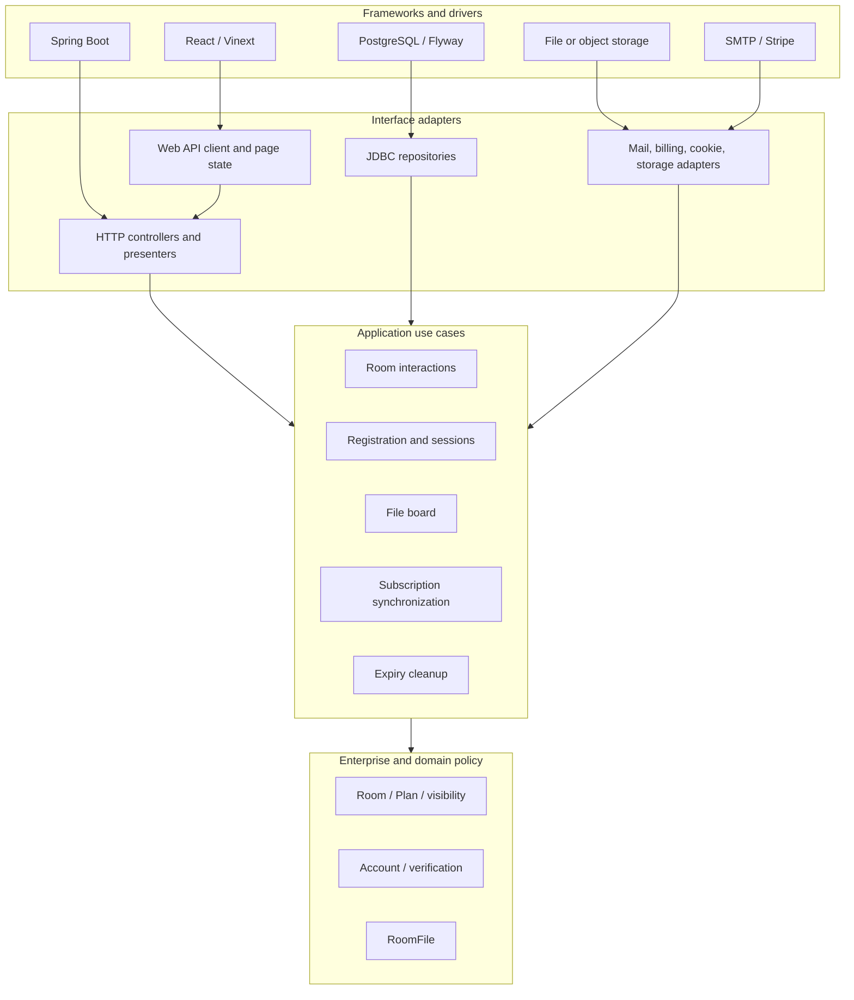
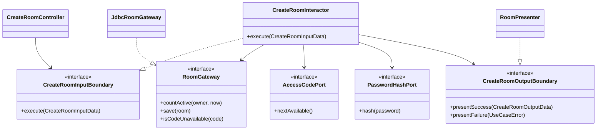

# 5. Clean Architecture

**Status: CA-inspired current structure; explicit target boundaries for new work**

## Dependency rule

Source-code dependencies point toward policy. Domain entities know nothing
about HTTP, React, Spring, JDBC, SMTP, Stripe, or a filesystem. Use cases know
which capabilities they need but not which framework supplies them. Adapters
translate between external contracts and use-case input/output data.



Arrows describe source dependency, not runtime call direction. At runtime an
interactor calls a gateway through an interface owned by the inner layer.

## Current mapping

| CA role | Current MySend types | Assessment |
| --- | --- | --- |
| Entities | `Room`, `Plan`, `RoomVisibility`, `Account`, `EmailVerification`, `RoomFile` | Domain records and plan limits are framework-light. |
| Input adapters | `RoomController`, `AccountController`, `FileBoardController`, `BillingController` | Controllers validate HTTP input and call services. |
| Interactors | `RoomService`, `AccountService`, `FileBoardService`, `StripeService` | Business flow is centralized, although some provider work remains mixed into services. |
| Persistence adapters | `RoomRepository`, account/session/token/file repositories | JDBC is isolated by package, but interactors currently depend on concrete classes. |
| Output/provider adapters | `VerificationMailer`, `LocalFileStore`, Spring `RestClient` use in `StripeService` | Mail and file storage have useful seams; Stripe needs a dedicated gateway. |
| Presenters | Controller response records and frontend `api.ts` types | Output translation exists but is not modeled as an output boundary. |
| Composition/framework | Spring configuration, `application.yml`, Flyway, React routes | Correctly sits at the outside of policy. |

The current modular monolith is suitable for an MVP, but it is not described as
strict Clean Architecture. In particular, concrete repository dependencies,
controller-owned response models, and Stripe HTTP calls inside the billing
service point outward from application policy.

## Target use-case boundary

New or substantially changed use cases should move toward this shape:



The interactor owns orchestration and rule ordering. Input data contains plain
use-case values, not servlet requests or Spring annotations. Output data
contains stable product results, not HTTP response types. Controllers and
presenters decide how those values become JSON and status codes.

## Boundary catalogue

| Use-case group | Input boundary | Required output/gateway ports |
| --- | --- | --- |
| Rooms | create, enter, load, update clipboard, update policy, close | room gateway, code generator, password hash, clock, room-token issuer, output presenter |
| Files | list, upload, download, delete | room authorization, file metadata gateway, object store, upload policy, output presenter |
| Accounts | request verification, verify, login, logout, current account | account, verification, attempt and session gateways; password hash; mail; clock |
| Billing | create checkout, create portal, synchronize subscription | billing provider, account gateway, event-claim gateway, signature verifier, clock |
| Cleanup | expire credentials, purge room | room/file/session/verification gateways, object store, clock, operational logger |

Interfaces belong beside the use case that needs them. Adapters implement those
interfaces from the outer layer.

## Data flow rules

1. A UI action becomes a web request DTO.
2. The controller validates transport shape and maps it to input data.
3. The input boundary executes business rules using entities and gateway ports.
4. The output boundary maps success or a stable use-case error to a view model.
5. The controller adapter selects HTTP status, cookies, and headers.
6. The frontend API adapter maps JSON to page state.

Transport validation answers “is this request well formed?” Use-case validation
answers “is this operation allowed for this actor and plan?” Both are required.

## Package and dependency policy

Target packages for future refactoring:

```text
com.mysend.domain
com.mysend.usecase.room
com.mysend.usecase.account
com.mysend.usecase.file
com.mysend.usecase.billing
com.mysend.adapter.web
com.mysend.adapter.persistence
com.mysend.adapter.mail
com.mysend.adapter.billing
com.mysend.adapter.storage
com.mysend.framework
```

Rules:

- `domain` imports Java standard-library types only.
- `usecase` imports `domain` and interfaces it owns.
- adapters import use-case boundaries and framework libraries.
- framework configuration creates adapters and wires boundaries.
- no controller calls a repository directly.
- no entity reads environment variables, cookies, or the system clock directly.
- no provider payload becomes a domain object without adapter translation.

The package migration should happen per changed use case, not as a repository-
wide rewrite.

## Testing by ring

| Ring | Test focus | External dependencies |
| --- | --- | --- |
| Entity | closure, remaining entries, plan invariants | None |
| Use case | normal and alternate flows through fake gateways | None |
| Adapter | SQL mapping, HTTP DTOs, cookie flags, provider signatures, file naming | H2/test server/temp storage as appropriate |
| Framework | Spring wiring, Flyway, production configuration | Application context and containers |
| End to end | browser creation, entry, clipboard, file, account, billing sandbox | Running web/API/database and sandbox providers |

## Refactoring priorities

1. Introduce `RoomGateway` and `RoomAccessTokenGateway` when the next room use
   case changes.
2. Split Stripe provider HTTP/signature parsing from subscription policy.
3. Add an object-store port with compensation or orphan cleanup before remote
   object storage is enabled.
4. Move response records out of controllers when a second client or API version
   appears.
5. Keep existing tests green while migrating one boundary at a time.
