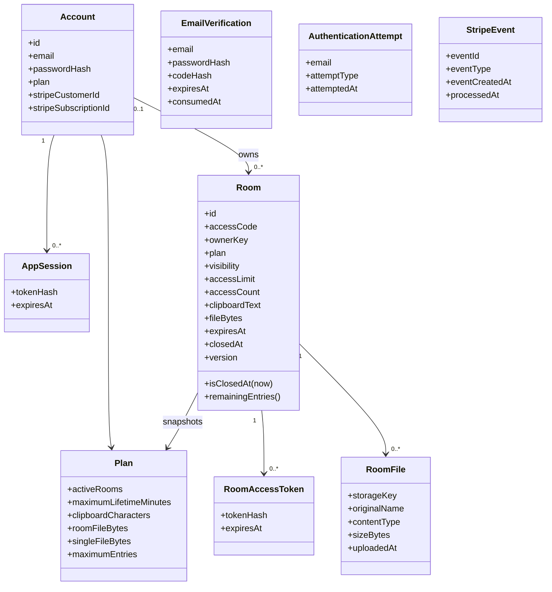

# 5. Domain model

**Status: Baseline — conceptual model approved before persistence design**

## Ubiquitous language

| Term | Meaning |
| --- | --- |
| ShareRoom | Time- and entry-bounded workspace containing one clipboard and one file board |
| Owner | Device or account identity allowed to manage the room |
| Participant | Owner or visitor holding valid room authorization |
| Entry | One successful code/password exchange that issues a room token |
| Plan snapshot | Guest, Free, or Premium limits captured on the room at creation |
| Logical closure | Immediate denial caused by manual close, time expiry, or entry exhaustion |
| Physical purge | Later deletion of files, tokens, and room metadata |

## Conceptual model

Email verifications and authentication attempts are keyed by normalized email
before an account necessarily exists. Stripe events form an idempotency ledger
rather than a child collection of an account.

## Aggregate boundaries

### Room aggregate

`Room` is the consistency boundary for access count, plan limits, clipboard,
file-byte accounting, settings, expiry, and version. `RoomFile` content lives in
external storage, but its metadata and byte count must agree with the Room
aggregate.

Key invariants:

- access code is exactly four digits followed by one uppercase letter;
- access code is unique among retained rooms;
- `0 <= accessCount <= accessLimit <= plan.maximumEntries`;
- `expiresAt` is between five minutes and the plan maximum after `createdAt`;
- clipboard length is no greater than the plan snapshot;
- `0 <= fileBytes <= plan.roomFileBytes`;
- every room token expires no later than its room;
- only an owner changes settings, closes the room, or deletes a file;
- a participant may read and update shared content only while the room is open;
- each successful mutation increments `version`.

### Account aggregate

`Account` owns normalized email uniqueness, password hash, plan, and Stripe
references. Sessions are revocable credentials for the account. The account
plan changes only from verified local registration or an accepted Stripe event.

Key invariants:

- normalized email is unique;
- a newly verified account starts on Free;
- plaintext passwords, verification codes, session tokens, and Stripe webhook
  secrets are never stored in domain records;
- an older Stripe event cannot overwrite newer subscription state;
- one Stripe event ID is processed at most once.

## Room state model

```mermaid
stateDiagram-v2
    [*] --> Open: room created
    Open --> Closed: owner closes
    Open --> Expired: expiresAt reached
    Open --> Exhausted: accessCount reaches accessLimit
    Closed --> PurgeEligible: retention cutoff reached
    Expired --> PurgeEligible: retention cutoff reached
    Exhausted --> PurgeEligible: retention policy reached
    PurgeEligible --> Purged: files and metadata deleted
    PurgeEligible --> PurgeEligible: storage deletion failed; retry later
    Purged --> [*]
```

`Closed`, `Expired`, and `Exhausted` are all logically unavailable. They are
shown separately because their cause matters for operations even though the
public response is intentionally the same.

## Access-code capacity

The generator uses 10,000 numeric prefixes and 24 readable letters, for a
theoretical pool of 240,000 codes. A code remains unavailable until its room
record is physically deleted, not merely until the room closes.

With the 24-hour content-purge objective, occupancy is approximately the number
of rooms created during the previous day plus rooms waiting on cleanup retry.
Alert at 25% occupancy (60,000 retained codes) and stop unreviewed growth work
at 50% (120,000 retained codes).

Before traffic approaches that level, choose one of these target changes:

1. shorten the purge objective below 24 hours;
2. separate content-free operational tombstones from reusable access codes; or
3. enlarge the code format while preserving spoken readability.

## Persistence ownership

| Data | Authoritative store | Retention rule |
| --- | --- | --- |
| Account and plan | PostgreSQL | Until account deletion is designed and requested |
| Account session | PostgreSQL, hashed token | Until revocation or expiry |
| Verification | PostgreSQL, hashed code | Ten-minute usability; expired rows cleaned later |
| Room metadata and clipboard | PostgreSQL | Logically unavailable at closure; physical purge within 24 hours |
| Room token | PostgreSQL, hashed token | No later than room expiry |
| File metadata | PostgreSQL | Purged with its room |
| File bytes | Mounted or object storage | Purged before the room record is removed |
| Authentication attempt | PostgreSQL | One-day cleanup horizon |
| Stripe event claim | PostgreSQL | Retained for webhook idempotency and audit |

## Resolved domain decisions

- Successful registration or login atomically claims still-open Guest rooms
  when the same request proves their device owner identity.
- My ShareRooms excludes manual closure, expiry, and entry exhaustion.
- Room content and reusable code reservation are purged within 24 hours. Any
  longer operational audit uses a content-free record without that code.
- A Premium downgrade does not change an already open room. The plan snapshot
  lets it finish under original limits, bounded by three hours.
