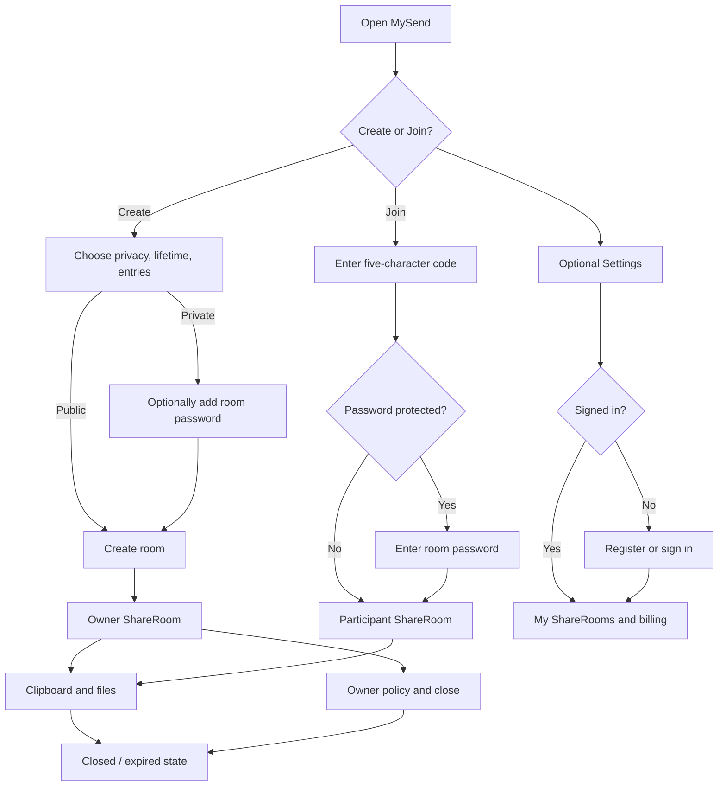

# 5. User interaction design

**Status: Baseline — wireflows approved before visual implementation**

## Design inputs

Interaction starts only after the product behaviour is defined. It presents
FR-01-FR-30 from [1. Requirements baseline](01-requirements.md) and invokes
UC-01-UC-09 from [2. Use cases](02-use-cases.md); it does not create a second
set of plan, authorization, or lifecycle rules in the browser.

| Destination | User goal | Requirements presented |
| --- | --- | --- |
| Home - Create | Start a valid room without account friction | FR-01-FR-04, FR-29-FR-30 |
| Home - Join | Enter an open room using the minimum required credential | FR-05-FR-08, FR-30 |
| ShareRoom - Status | Understand room identity, authority, capacity, and closure | FR-09-FR-12, FR-27, FR-29 |
| ShareRoom - Workspace | Exchange clipboard text and files safely | FR-13-FR-17, FR-30 |
| Settings - Account | Register once, sign in/out, and find active rooms | FR-18-FR-23, FR-30 |
| Settings - Billing | Compare, upgrade, and manage Premium | FR-24-FR-26, FR-30 |

## Interaction goals

- A new visitor understands Create versus Join without reading documentation.
- The primary task begins above the fold and never starts with authentication.
- Privacy, lifetime, entry limit, and plan capacity are visible at the moment
  they affect a decision.
- The ShareRoom keeps code/status, clipboard, files, and controls in one place.
- Every asynchronous action has idle, working, success, recoverable failure,
  and terminal failure behaviour.

## Product-level wireflow



## Home wireframe

Desktop composition:

```text
┌──────────────────────────────────────────────────────────────────────┐
│ MySend                         How it works   Plans   Settings        │
├──────────────────────────────────────────────────────────────────────┤
│                                                                      │
│  SEND WHAT YOU NEED.            ┌──────────────┬──────────────┐      │
│  Short supporting sentence      │ CREATE ROOM  │ JOIN BY CODE │      │
│                                 ├──────────────┴──────────────┤      │
│  01 No app                      │ task-specific fields        │      │
│  02 Memorable code              │                              │      │
│  03 You control close           │ primary action          ↗   │      │
│                                 └─────────────────────────────┘      │
└──────────────────────────────────────────────────────────────────────┘
```

Create interaction:

1. Create tab is selected for a first visit.
2. Public is the low-friction default; selecting Private reveals password as
   optional rather than shifting the entire layout.
3. Lifetime and entries show only choices permitted for the identified plan.
4. Guest plan copy appears beside the action, not in a blocking dialog.
5. Submit locks only the form, shows progress, and navigates directly to the
   owner room on success.
6. A plan-limit error keeps every selection and offers the useful recovery:
   close another room, reduce a value, sign in, or upgrade.

This flow presents FR-01-FR-04 and invokes UC-01. The visual plan hint is not
authoritative; a rejection from the use case remains possible and preserves
the submitted choices.

Join interaction:

1. The code input accepts pasted or typed lowercase/uppercase text and displays
   the normalized form.
2. The first submit checks the room. A password field appears only when the
   room requires one.
3. Wrong password keeps the normalized code, clears the password, and does not
   imply that an entry was consumed.
4. Unknown, expired, closed, and exhausted rooms use one unavailable state with
   a route back to the code input.
5. Success navigates to the room without requesting registration.

This flow presents FR-05-FR-08 and invokes UC-02. Password prompting is a
continuation of one entry attempt, while the successful-entry allowance is
consumed only by the accepted use-case result.

Mobile order is headline → task switcher → task fields → product explanation.
Create/Join tabs stay visible while their form is active.

## ShareRoom wireframe

```text
┌──────────────────────────────────────────────────────────────────────┐
│ MySend                                               Settings        │
├──────────────────────────────────────────────────────────────────────┤
│ ROOM 4821K   [Copy code]          ┌───────────────────────────────┐ │
│                                  │ LIVE     CLOSES IN      42:18 │ │
│                                  │ public   3/20   guest          │ │
│                                  └───────────────────────────────┘ │
├───────────────────────────────┬──────────────────────────────────────┤
│ 01 CLIPBOARD                  │ 02 FILE BOARD                       │
│                               │                                    │
│ editable shared text          │ drop/browse                         │
│                               │ file rows + download                │
│ count / limit       Save      │ used / limit                        │
├───────────────────────────────┴──────────────────────────────────────┤
│ OWNER ONLY: privacy · password · entries · close time · close       │
└──────────────────────────────────────────────────────────────────────┘
```

Workspace rules:

- Room identity and countdown remain visible before content controls.
- Clipboard Save is disabled until content differs from the last accepted
  version. Success updates the version; conflict pauses editing and offers
  “Load latest” before any retry.
- The file target supports click, keyboard activation, and drag/drop. Upload
  progress belongs to the file row so other room work remains available.
- Visitors may add and download files but do not receive delete or room-policy
  controls.
- Owner controls are collapsed on small screens but never moved to Settings.
- Closing requires confirmation because it is immediately terminal.
- At expiry/closure, editable controls are replaced by a closed explanation;
  stale content is not left interactable on screen.

Capability presentation follows the use-case result:

| Capability | Owner | Entered visitor |
| --- | ---: | ---: |
| Read room status, clipboard, and file list | Yes | Yes |
| Save clipboard | Yes | Yes |
| Upload and download files | Yes | Yes |
| Delete a file | Yes | No |
| Change privacy, password, lifetime, or entries | Yes | No |
| Close the room | Yes | No |

Hiding an action is presentation, not authorization. UC-03-UC-06 still reject
an unauthorized request from a modified or stale client.

Mobile order is room status → clipboard → file board → owner controls. The two
workspace surfaces do not shrink into unreadable side-by-side columns.

## Settings wireframe

```text
┌──────────────────────────────────────────────────────────────────────┐
│ YOUR ROOMS, YOUR LIMITS                                              │
├───────────────────────────────┬──────────────────────────────────────┤
│ SIGN IN | CREATE ACCOUNT      │ PREMIUM   CA$9.99 / MONTH           │
│                               │                                    │
│ email                         │ Free → Premium limit comparison     │
│ password                      │ upgrade/manage billing action       │
│ verification step when new   │                                    │
├───────────────────────────────┴──────────────────────────────────────┤
│ MY SHAREROOMS: active account-owned rooms                           │
└──────────────────────────────────────────────────────────────────────┘
```

Authentication interaction:

- Create account first collects email/password and explains the ten-minute
  verification step.
- After requesting a code, email becomes read-only unless the user explicitly
  goes back; expiry and resend timing are visible.
- Successful verification signs the user in and claims still-open Guest rooms
  owned by the same device before loading My ShareRooms.
- Login failure does not identify whether email or password was wrong.
- Sign out returns Settings to unauthenticated state; guest Create/Join remains
  available from Home.

Billing interaction:

- The limit comparison explains what changes; checkout remains a separate
  Stripe-hosted page.
- Returning from checkout shows “confirming payment” until a refreshed account
  response reflects the signed webhook. The return URL alone never displays a
  completed upgrade.
- Premium members see Manage billing rather than another Upgrade action.

Settings presents FR-18-FR-26 through UC-07-UC-09. Registration verification
is required only for first account creation; ordinary login remains an
email/password flow.

## Feedback and failure states

| Action | Working state | Recoverable failure | Terminal state |
| --- | --- | --- | --- |
| Create room | Disable form submit; preserve fields | Show specific plan/configuration correction | Service unavailable with retry |
| Join | Disable join action; preserve code | Wrong password or retry window | Room unavailable |
| Clipboard save | “Saving…” beside count | Conflict offers Load latest; limit keeps text | Room closed replaces editor |
| Upload | Per-file progress | Retry storage/network failure | Room closed or type prohibited |
| Registration | Sending/verifying state | Resend timing, wrong/expired code | Email already registered routes to Sign in |
| Checkout | Redirecting/confirming | Provider unavailable allows retry | Subscription cancellation leaves Free plan |

Messages state what happened and the next useful action. Toasts may confirm a
completed copy/save, but errors that block work remain next to the affected
control until resolved.

## Interaction acceptance gate

Before visual implementation:

- clickable or paper prototypes complete Guest create, public/private join,
  clipboard, files, owner close, registration, My ShareRooms, and billing;
- all paths have loading, empty, validation, conflict, unavailable, and closed
  states;
- desktop and mobile reading order is agreed;
- keyboard focus order and screen-reader labels are specified;
- no primary sharing journey redirects to authentication;
- API design can name every interaction input and output without inventing a
  new product rule.

## Interaction traceability

| Journey | Use case | Required states | Verification |
| --- | --- | --- | --- |
| Guest creates a public room | UC-01 | idle, invalid policy, limit reached, creating, created, service failure | No auth redirect; owner workspace opens without consuming an entry. |
| Visitor enters public/private room | UC-02 | code entry, password requested, wrong password, unavailable, entering, entered | Case normalization works; only the accepted result navigates. |
| Participant opens room | UC-03 | loading, authorized, access required, closed | Unauthorized states display no content. |
| Participant saves clipboard | UC-04 | clean, dirty, saving, saved, limit, conflict, closed | Conflict keeps local text and offers Load latest. |
| Participant uses file board | UC-05 | empty, listing, per-file progress, complete, quota/type/store failure | Failures stay on the affected row and do not falsify quota. |
| Owner manages/closes room | UC-06 | unchanged, saving, conflict, confirming close, closed | Visitor has no controls; close replaces all editing. |
| Member authenticates | UC-07 | credentials, sending, code entry, resend cooldown, verified, login failure, signed out | Code expiry is visible; login never asks for another code. |
| Member loads rooms | UC-08 | loading, empty, populated, account required | Only active account-owned rooms appear. |
| Member manages Premium | UC-09 | comparing, redirecting, provider failure, confirming event, Premium, manage billing | Browser return alone never claims success. |

The prototype is rejected if any state requires a new business decision that
is absent from the requirements and use-case documents.
