# 6. System sequences

**Status: Baseline — runtime collaboration designed before adapters**

These diagrams connect the use cases to their adapters. They describe ordering
and trust boundaries; method names may evolve without changing the sequence.
Each diagram names the requirement/use-case contract it realizes and draws the
failure order that adapters must preserve.

## Create a guest room

**Trace:** UC-01; FR-01-FR-04; INV-01, INV-06, INV-08

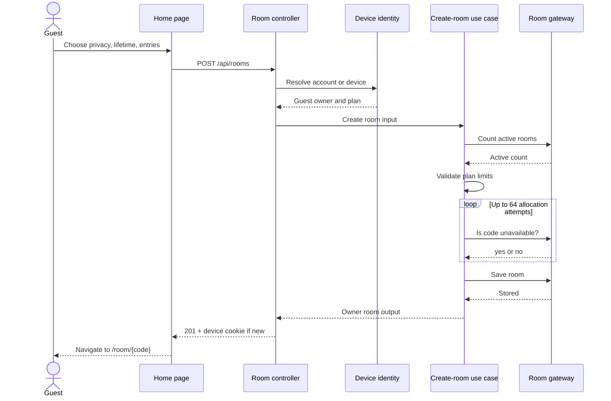

No room is written when identity resolution, plan validation, or code
allocation fails.

## Enter a private room

**Trace:** UC-02; FR-05-FR-09; QR-01; INV-01-INV-05

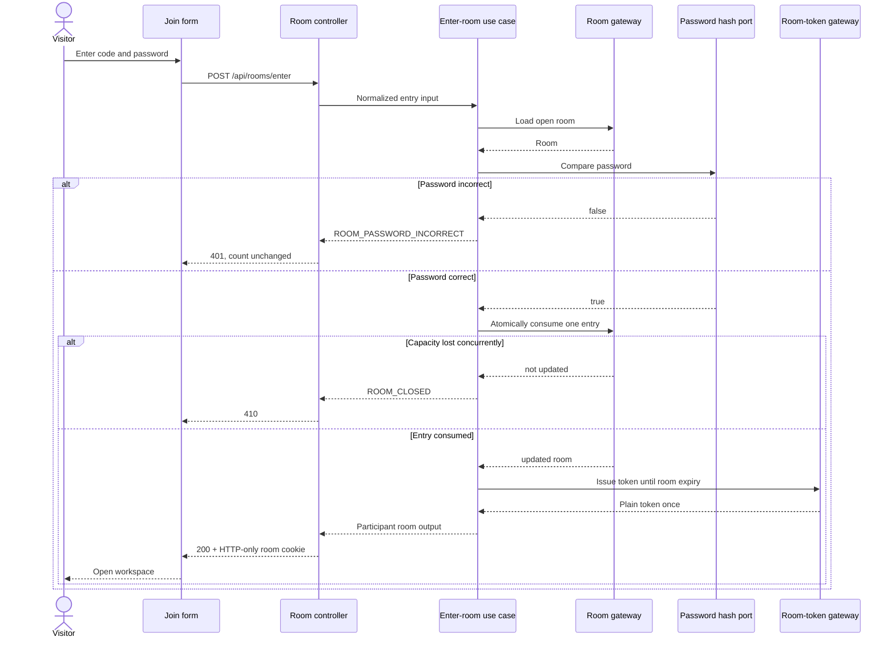

Password comparison always precedes entry consumption. Token issuance always
follows successful atomic consumption.

## Open an authorized room

**Trace:** UC-03; FR-09-FR-10, FR-27, FR-29-FR-30; INV-04-INV-05

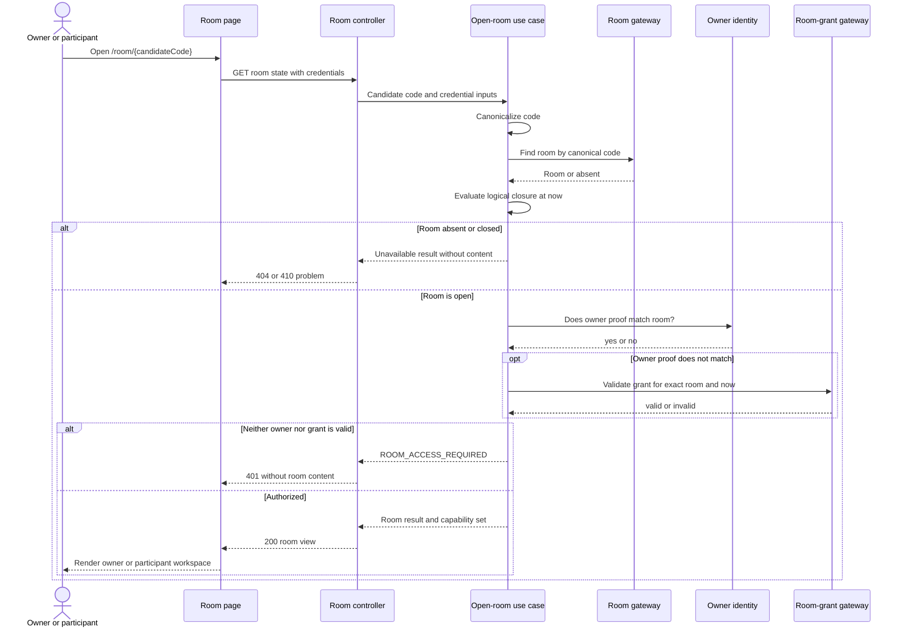

Open-state evaluation precedes content projection. A grant is checked against
the loaded room identity rather than treated as general room access.

## Update the clipboard with optimistic concurrency

**Trace:** UC-04; FR-13-FR-14; QR-02; INV-04-INV-06

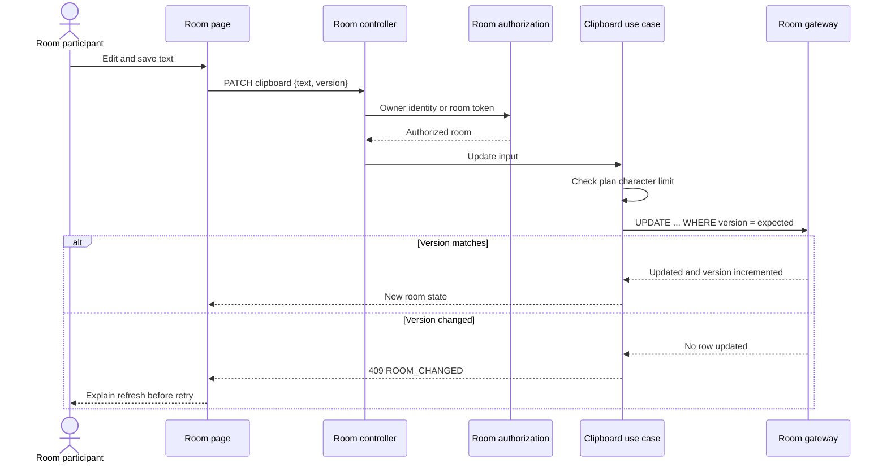

## Upload a file

**Trace:** UC-05; FR-15-FR-17; QR-04; INV-04-INV-07, INV-11

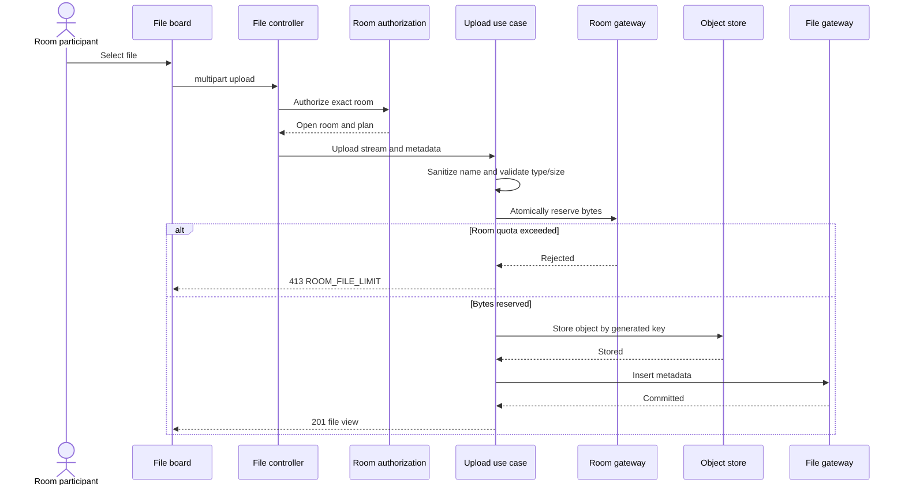

**Target failure path:** storage or metadata failure releases reserved bytes;
a stored object without committed metadata is deleted immediately or queued for
orphan cleanup.

## Manage settings and close a room

**Trace:** UC-06; FR-11-FR-12, FR-27, FR-29-FR-30; QR-02; INV-04,
INV-06-INV-08

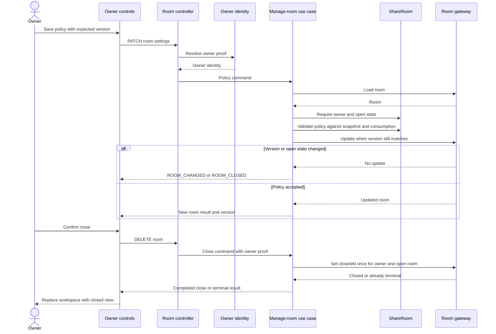

Ownership and plan validation precede mutation. Close is monotonic: a repeated
or racing request never returns the room to Open.

## Register a Free account

**Trace:** UC-07; FR-18-FR-22; INV-09, INV-12

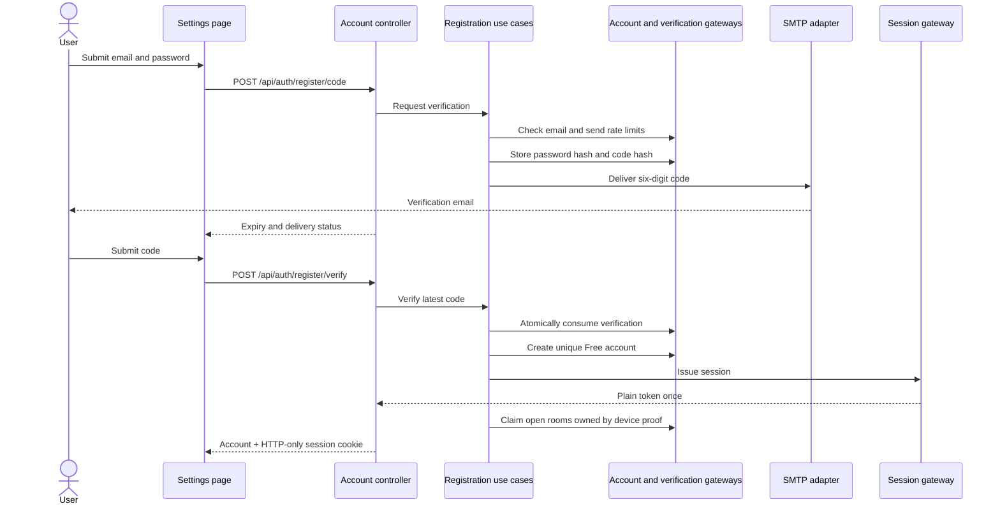

If mail delivery is not configured in production, the flow fails rather than
exposing the verification code. A development code may be returned only when
explicitly enabled outside production.

## Sign in a returning member

**Trace:** UC-07; FR-20-FR-22; QR-07-QR-09; INV-12

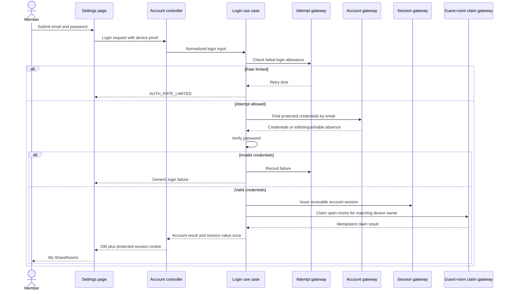

Ordinary login has no email-code step. Device proof can add eligible rooms but
failure to claim a closed/foreign room cannot transfer ownership.

## Load My ShareRooms

**Trace:** UC-08; FR-23, FR-29-FR-30; INV-04, INV-12

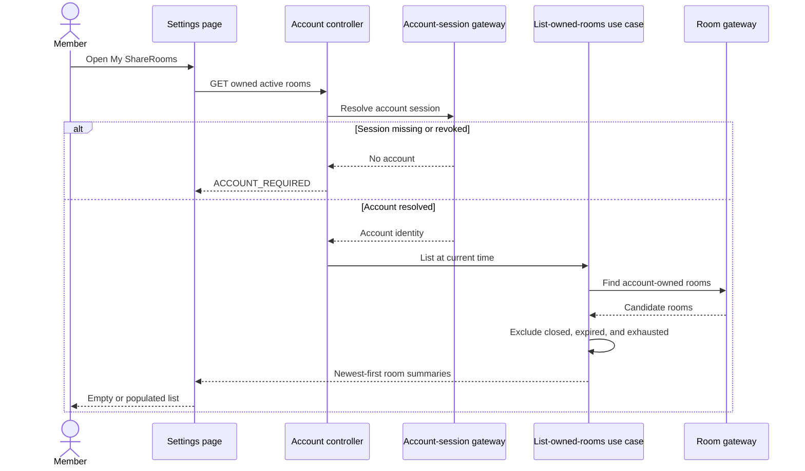

List membership never replaces room authorization; opening an item still uses
UC-03 and reevaluates logical closure.

## Upgrade and synchronize Premium

**Trace:** UC-09; FR-24-FR-26; INV-08, INV-10

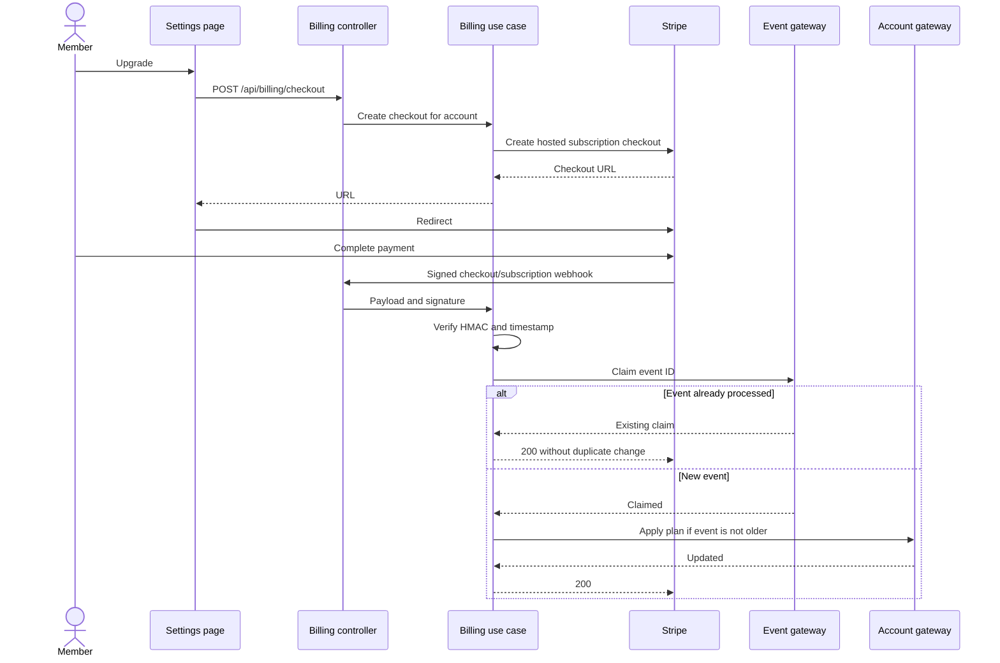

The redirect is not proof of payment. Only a verified webhook changes the plan.

## Expire and purge a room

**Trace:** UC-10; FR-27-FR-28; QR-10, QR-12; INV-04-INV-05, INV-11

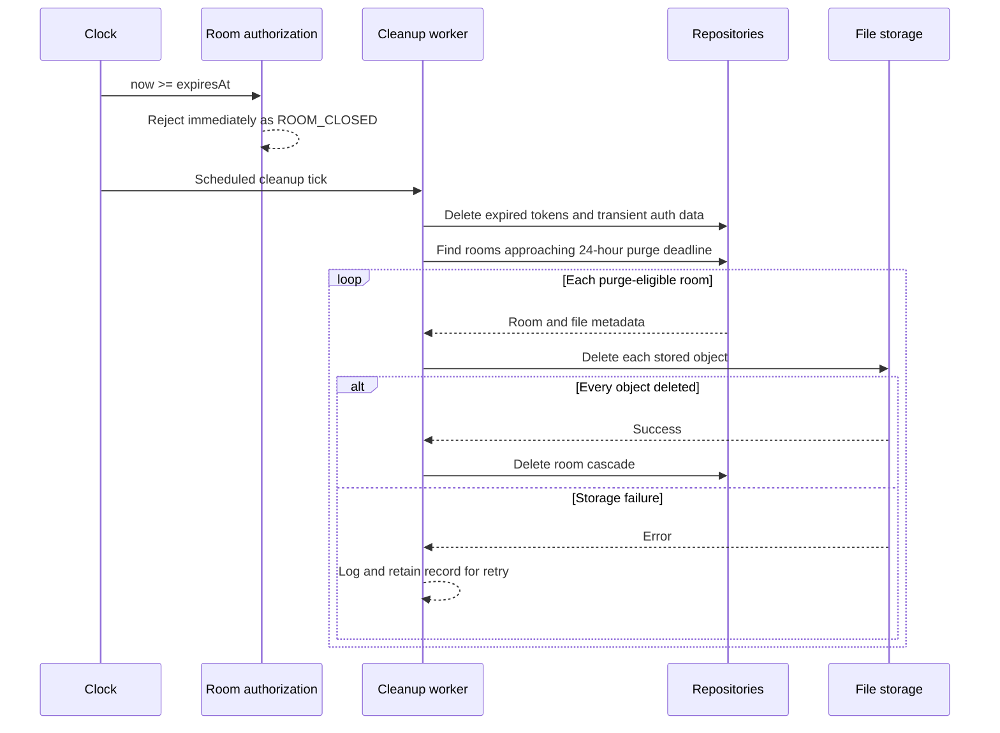

Logical closure is part of request authorization. The scheduled job is not
allowed to be the mechanism that makes an expired room inaccessible.

## UI state transitions

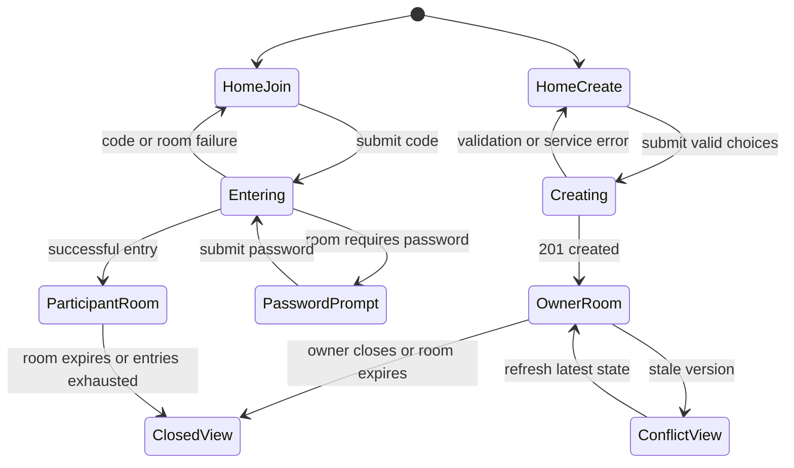
