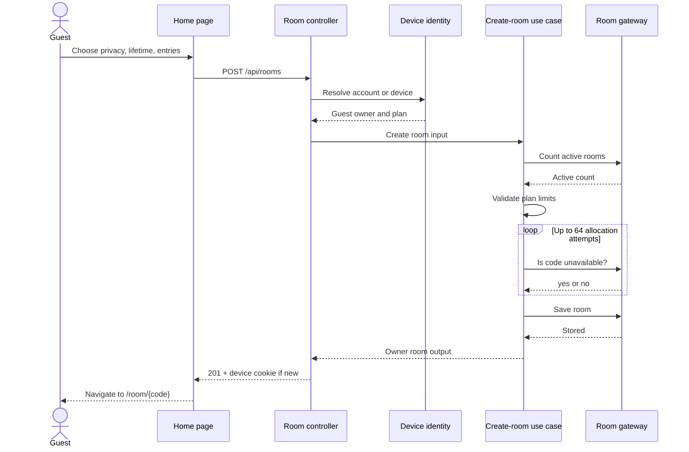
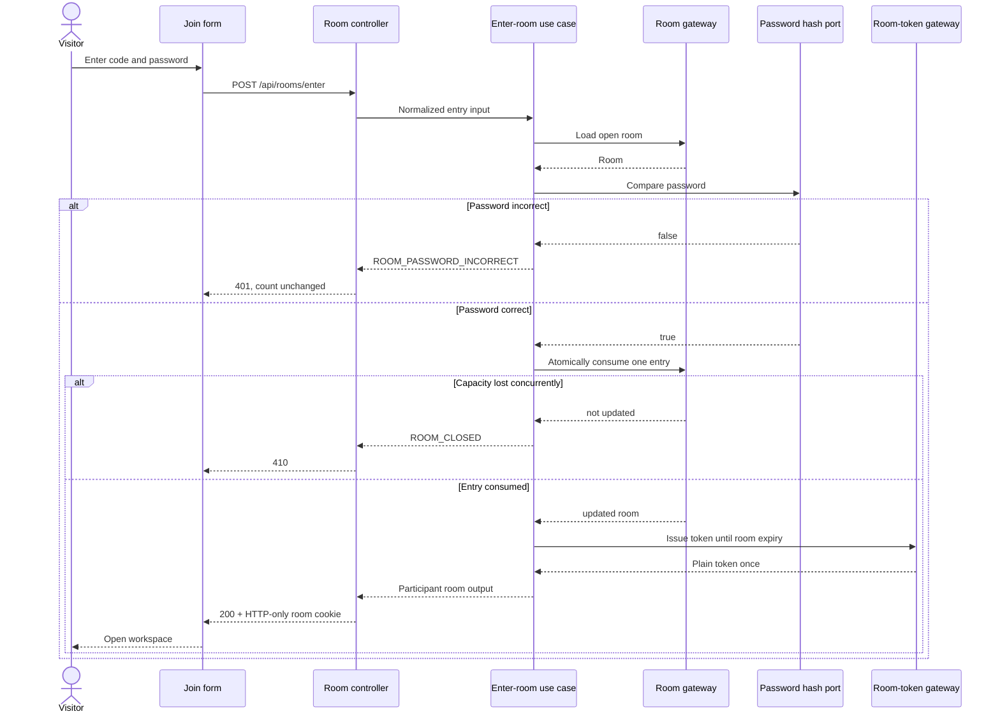
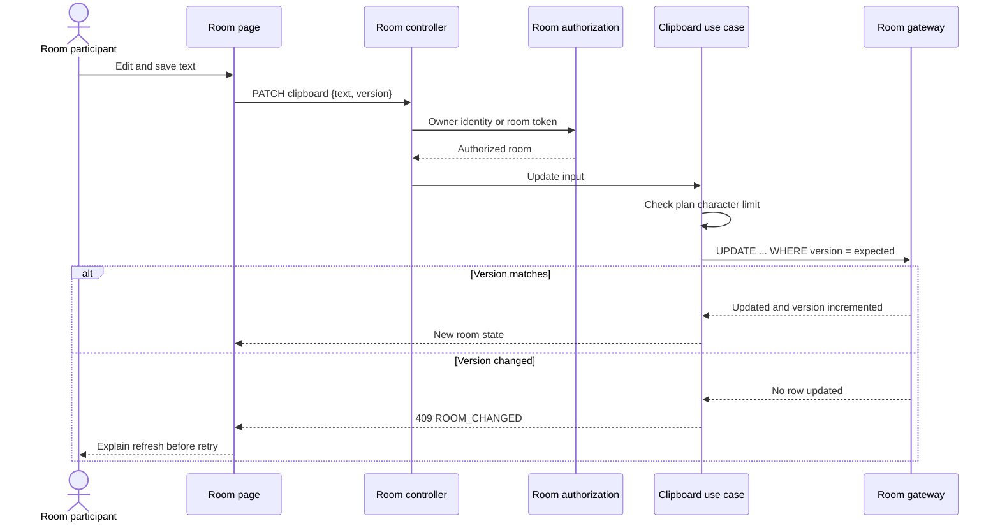
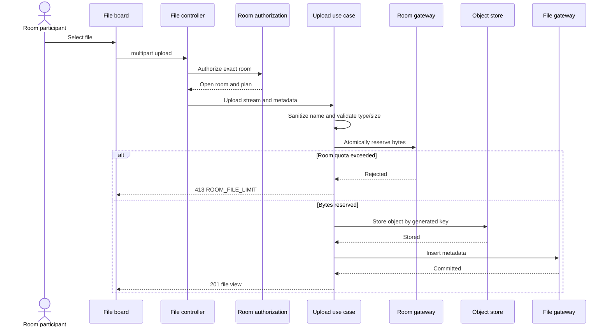
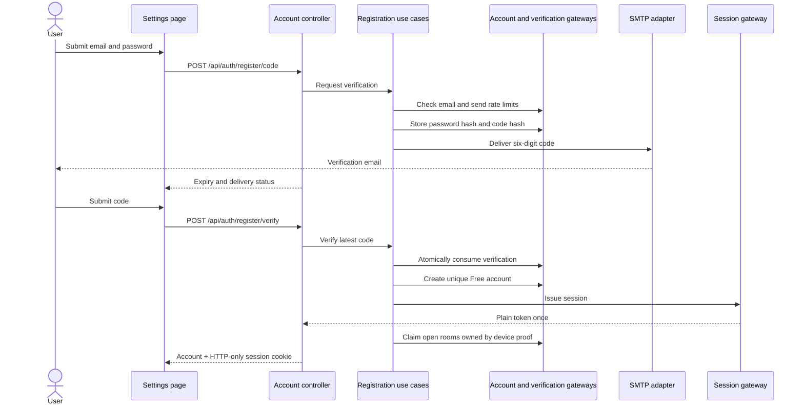
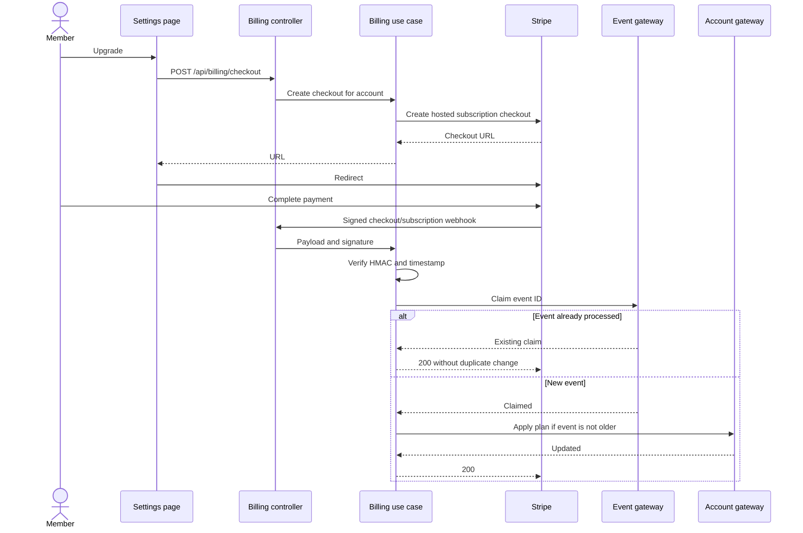
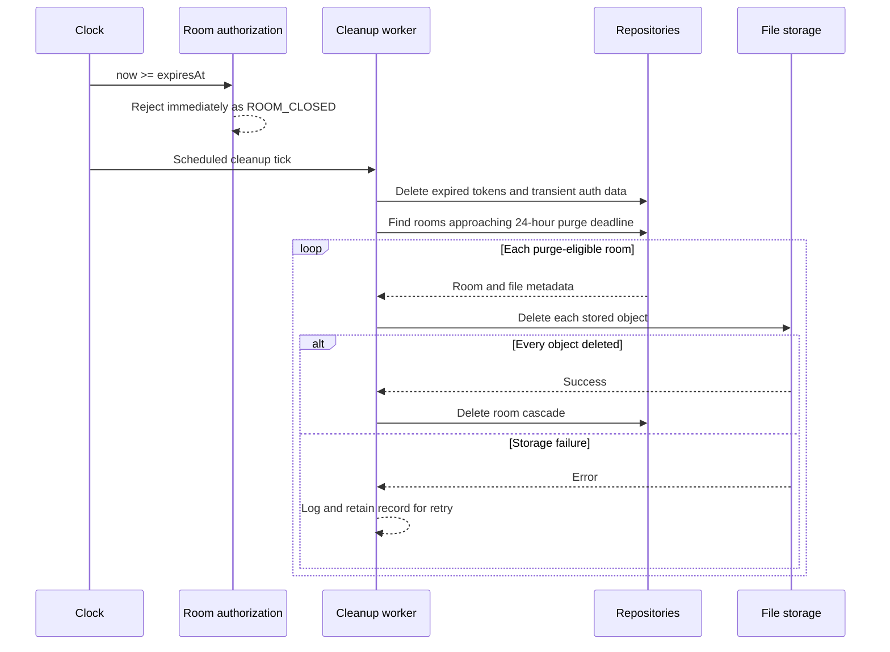
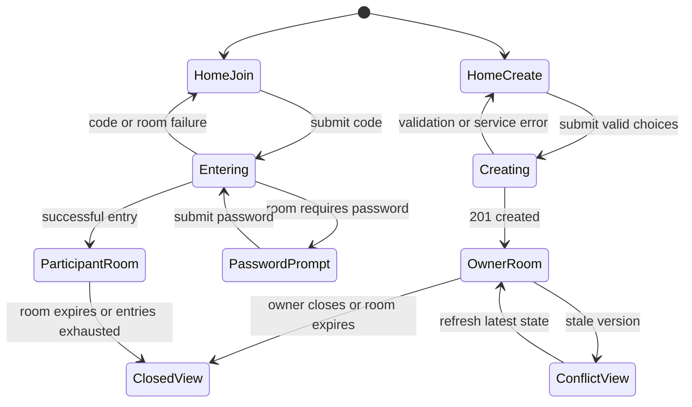

# 7. System sequences

**Status: Baseline — runtime collaboration designed before adapters**

These diagrams connect the use cases to their adapters. They describe ordering
and trust boundaries; method names may evolve without changing the sequence.

## Create a guest room

No room is written when identity resolution, plan validation, or code
allocation fails.

## Enter a private room

Password comparison always precedes entry consumption. Token issuance always
follows successful atomic consumption.

## Update the clipboard with optimistic concurrency

## Upload a file

**Target failure path:** storage or metadata failure releases reserved bytes;
a stored object without committed metadata is deleted immediately or queued for
orphan cleanup.

## Register a Free account

If mail delivery is not configured in production, the flow fails rather than
exposing the verification code. A development code may be returned only when
explicitly enabled outside production.

## Upgrade and synchronize Premium

The redirect is not proof of payment. Only a verified webhook changes the plan.

## Expire and purge a room

Logical closure is part of request authorization. The scheduled job is not
allowed to be the mechanism that makes an expired room inaccessible.

## UI state transitions

