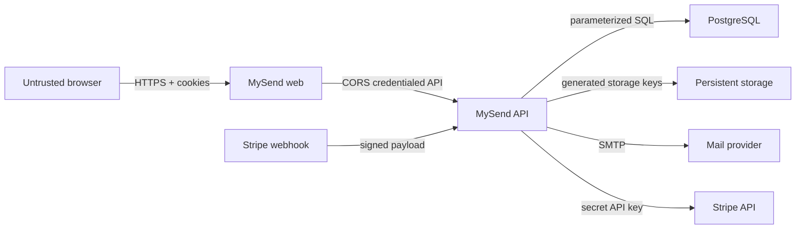
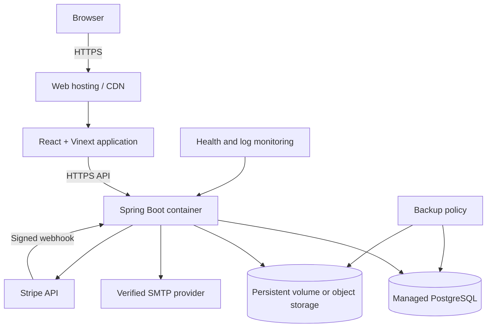

# 8. Security, operations, and validation

**Status: Baseline — security and operating design approved before deployment**

## Design inputs

This document defines how MySend proves the functional, quality, and invariant
contracts from [1. Requirements baseline](01-requirements.md) after the
boundaries in [4. System architecture](04-system-architecture.md) and [7.
Interface and API design](07-interface-and-api-design.md) are selected.

Security is an end-to-end property of the same Guest, Free, and Premium
protocol. A plan can increase capacity but cannot bypass a trust boundary or
receive weaker validation.

## Trust boundaries



Browser values, filenames, headers, cookies, provider payloads, and webhook
timestamps are untrusted until validated at their boundary.

## Threat and control map

| Threat | Requirements at risk | Designed control | Required public-launch verification |
| --- | --- | --- | --- |
| Guessing access codes | FR-05-FR-10, QR-08 | 240,000-code space, optional password, entry limit, identical unavailable response | Add IP/device entry throttling and monitor failed entry volume. |
| Password guessing | FR-06-FR-07, INV-02 | Adaptive password protection; failed private entry does not consume a slot | Add room/password attempt throttling without revealing room existence. |
| Credential theft | FR-09-FR-10, FR-20, QR-07 | Opaque random credentials, protected cookies, server-side hashes, room scoping | HTTPS only, secure cookies, short room lifetime, security-header review. |
| Cross-site mutation | FR-11-FR-17, FR-21, QR-07 | Credentialed CORS allowlist, required Origin and request marker | Keep exact production origins; automate cross-origin rejection tests. |
| Injection | FR-30, QR-07 | Boundary validation and parameterized data access | Ban concatenated client input in queries and scan/test adapters. |
| Path traversal | FR-15-FR-17, INV-11 | Generated storage identities and sanitized display names | Storage adapter never uses client names as object keys. |
| Malicious files | FR-15-FR-16, QR-09 | Extension/size policy, attachment download, `nosniff`, quarantine boundary | Add malware scanning, content-signature checks, archive limits, and operator review. |
| Resource exhaustion | FR-02, FR-15, FR-22, QR-03-QR-04 | Plan quotas, active-room limits, transfer streaming, authentication throttles | Add request/IP quotas, storage alarms, upload concurrency and bandwidth limits. |
| Lost concurrent update | FR-14, FR-11, QR-02 | Expected-version conditional changes | Run conflict-focused API/browser tests with clear refresh recovery. |
| Forged/replayed billing event | FR-26, INV-10 | Event authentication, timestamp tolerance, event-ID claim, causal ordering | Alert on authentication failures and retry backlog. |
| Secret exposure | FR-30, QR-07-QR-08 | Environment separation, protected credential representations, content-free logs | Use platform secret manager, rotation procedure, and commit scanning. |
| Expired data retained | FR-27-FR-28, QR-10 | Immediate lifecycle guard plus retryable physical cleanup | Measure purge lag and alert before the deadline. |

Access codes are locators, not high-entropy secrets. A private-room password is
the confidentiality control when code guessing is an unacceptable risk.

## Authorization matrix

| Action | Unentered visitor | Entered visitor | Owner | Signed-in account without ownership |
| --- | ---: | ---: | ---: | ---: |
| Enter with code/password | Yes | Yes, consumes another entry if repeated | Not required for direct owner access | Yes |
| Read room and files | No | Yes | Yes | No |
| Update clipboard | No | Yes | Yes | No |
| Upload file | No | Yes | Yes | No |
| Delete file | No | No | Yes | No |
| Change room policy | No | No | Yes | No |
| Close room | No | No | Yes | No |
| List My ShareRooms | No | No | Account-owned rooms only | Account-owned rooms only |

## Retention and deletion

| Record | Logical expiry | Physical cleanup |
| --- | --- | --- |
| Room access token | Room expiry | Scheduled deletion after expiry |
| Account session | Thirty days or logout | Scheduled deletion after expiry; immediate row deletion on logout |
| Verification code | Ten minutes or successful consumption | Scheduled deletion after expiry |
| Authentication attempt | Sliding rate-limit window | Older than one day |
| Room content | Manual close, expiry, or entry exhaustion | Clipboard, filenames, files, and code reservation removed within 24 hours |
| Stored file | Same logical room closure | Deleted before its room record is purged |
| Stripe event claim | Not user content | Retained for idempotency/audit until a separate policy is approved |

The 24-hour purge objective includes cleanup retries. If an operational audit
tombstone is required beyond it, the tombstone contains no clipboard text,
filename, file object, authorization token, or reusable access code.

## Deployment topology



The web and API deploy independently. The browser knows only public web/API
origins. Database credentials, SMTP credentials, Stripe secret keys, webhook
secret, and storage credentials exist only in the deployment secret manager.

### Environment groups

| Group | Examples | Rule |
| --- | --- | --- |
| Public web configuration | `NEXT_PUBLIC_API_BASE_URL`, `NEXT_PUBLIC_SITE_URL` | Safe for the browser bundle; contains origins, never secrets |
| Database | `DATABASE_URL`, username, password | PostgreSQL in production; least-privilege account |
| Browser trust | `WEB_ORIGINS`, `APP_BASE_URL`, `COOKIE_SECURE` | Exact HTTPS origins; secure cookies must be true |
| Storage | `UPLOAD_DIRECTORY`, `STORAGE_PERSISTENT` | Mounted durable path or object-store adapter |
| Mail | sender and SMTP host/port/user/password | Verified sender; development-code exposure false |
| Billing | Stripe secret, webhook secret, Premium price ID | Server secret manager only |

The production profile validates these requirements at startup and fails
closed instead of silently using local defaults.

## Operational signals

Minimum launch dashboards and alerts:

- API health/readiness and restart count;
- request rate and latency by endpoint group;
- `4xx` volume by stable error code, especially entry and rate-limit failures;
- `5xx`, file-store, mail-delivery, and billing-provider failures;
- active and retained room count, access-code occupancy, and creation failures;
- stored bytes, upload rate, quota rejection, and orphan-object count;
- cleanup duration, eligible-room count, purge lag, and retry failures;
- verification delivery rate and authentication throttling;
- Stripe webhook signature failure, processing failure, age, and retry backlog;
- PostgreSQL storage, connection use, backup success, and restore-test age.

Logs must not contain plaintext passwords, verification codes, session/room
tokens, Stripe secrets, full webhook signatures, clipboard text, or file
content.

## Failure and recovery policy

- Database failure: reject mutations; do not acknowledge uncommitted state.
- File storage failure: return a stable error and reconcile reserved bytes or
  orphan objects.
- Mail failure: do not create an unverifiable production registration path.
- Stripe API failure: leave account plan unchanged and allow checkout retry.
- Webhook failure: return non-success so Stripe retries; event claims prevent
  duplicate plan changes.
- Cleanup failure: retain metadata and retry; alert when purge lag exceeds its
  objective.
- Deployment rollback: application versions must remain compatible with
  already-applied forward database migrations.

PostgreSQL and stored files require independent backups until object storage
provides versioning. Restore instructions must be exercised, not merely written.

## Verification strategy

| Level | Required checks |
| --- | --- |
| Domain | Plan limits, code normalization, closure, remaining entries, plan snapshot |
| Use case | Success and every alternate flow for UC-01–UC-10 using controlled clocks and fake ports |
| Persistence | Migrations, unique email/code, atomic entry use, optimistic updates, event idempotency |
| Security adapter | cookie flags, origin/marker rejection, token scoping, webhook signature and age |
| Provider adapter | SMTP failure, Stripe error mapping, storage write/delete/compensation |
| API contract | validation fields, stable problem codes, authorization matrix, streamed downloads |
| Browser journey | guest create, public/private entry, clipboard conflict, upload/download, registration, My ShareRooms, Premium sandbox |
| Operations | container build, production-config refusal, health probe, cleanup retry, backup restore smoke test |

## Requirement verification matrix

| Requirements | Primary evidence | Required negative/boundary evidence |
| --- | --- | --- |
| FR-01-FR-04 | UC-01 unit tests, room-creation API contract tests, Guest browser journey | Second Guest room, every invalid limit, public-plus-password ambiguity, code collision exhaustion, save failure |
| FR-05-FR-10 | UC-02/UC-03 tests, concurrent entry integration test, public/private browser journeys | Malformed/unknown code, wrong password count unchanged, final-entry race, closed room, cross-room grant |
| FR-11-FR-14 | UC-04/UC-06 tests, owner/participant authorization matrix, versioned API tests | Visitor policy change/delete, below-consumed entry limit, stale update, closure race, oversized clipboard |
| FR-15-FR-17 | UC-05 tests, streamed upload/download contract test, storage compensation integration test | Empty/disallowed/oversized/cross-room file, visitor delete, object/metadata/delete failure, closure race |
| FR-18-FR-23 | UC-07/UC-08 tests, mail-adapter test, account API and browser journeys | Duplicate normalized email, wrong/expired/used code, login enumeration, each rate limit, foreign room claim, Guest room-list denial |
| FR-24-FR-26 | UC-09 tests, billing sandbox checkout/portal, authenticated webhook contract test | Browser-return-only, provider failure, no billing profile, bad signature/time, duplicate and older events, downgrade snapshot |
| FR-27-FR-28 | Controlled-clock lifecycle tests, cleanup/storage integration test, purge-lag monitor exercise | Every closure cause, stale grant, partial deletion, overlapping workers, retry crossing alert threshold |
| FR-29-FR-30 | UI state review, capability snapshots, API problem-contract tests | No owner controls for visitor, no editable closed state, no sensitive problem fields, stable codes independent of message |
| QR-01-QR-04 | Load/concurrency suite and transfer instrumentation | Last-entry contention, same-version contention, 50-user reference load, maximum-size streamed transfer |
| QR-05-QR-06 | Automated accessibility checks plus keyboard/screen-reader/responsive manual pass | 360-pixel layout, non-colour status, focus restoration after every failure/dialog |
| QR-07-QR-10 | Security adapter tests, fault injection, retry/idempotency tests, retention exercise | Script access to credentials, sensitive logs, partial provider failures, duplicate retry, near-deadline purge |
| QR-11-QR-13 | Dependency-rule tests, fake-port use-case suite, metrics/log review, clean production startup/build | Forbidden inward imports, missing signal, unsafe production configuration, readiness under database failure |
| INV-01-INV-12 | Domain/value-object tests plus persistence concurrency/constraint and compensation tests | Invalid construction, forbidden transitions, every race/replay/foreign-owner case from the invariant table |

Each implementation pull request names the applicable rows and adds evidence
for every new alternate flow. A green happy-path browser test alone is not
sufficient evidence for a requirement.

## Evidence ownership

| Evidence | Owner | Retention |
| --- | --- | --- |
| Unit, contract, integration, and browser results | CI pipeline | Attached to the commit/PR run |
| Accessibility/manual journey checklist | Release reviewer | Release record |
| Load and maximum-transfer result | Performance reviewer | Release record plus environment description |
| Security/configuration review | Security/release reviewer | Release record without secrets |
| Backup restore and cleanup-deadline exercise | Operator | Timestamped operating log/metric snapshot |
| Billing/mail/storage sandbox result | Adapter owner | Release checklist with provider identifiers redacted |

Standard repository checks:

```bash
npm ci
npm run check

cd backend
mvn --batch-mode --no-transfer-progress verify

docker compose up --build --wait
```

## Public-launch gates

The product is ready for public traffic only when:

- production domains, HTTPS, exact allowed origins, and secure cookies work;
- PostgreSQL backup and restore are tested;
- uploads use durable storage and malware/quarantine policy is active;
- registration email uses a verified sender and failed delivery is observable;
- Stripe live checkout, portal, cancellation, webhook retry, and signature
  failure are tested;
- entry/password and upload abuse controls operate beyond per-account limits;
- room content retention and access-code occupancy objectives are approved;
- the guest-to-account ownership decision is implemented;
- end-to-end journeys and accessibility checks pass;
- on-call ownership and rollback steps are written.

Until these gates pass, a deployment should be described as a private preview
or test environment rather than a production release.
