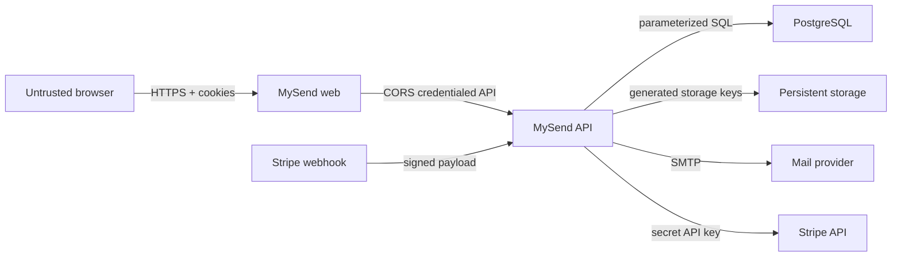
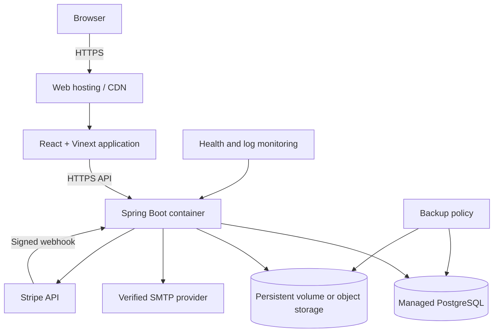

# 9. Security, operations, and validation

**Status: Baseline — security and operating design approved before deployment**

## Trust boundaries



Browser values, filenames, headers, cookies, provider payloads, and webhook
timestamps are untrusted until validated at their boundary.

## Threat and control map

| Threat | Designed control | Required public-launch verification |
| --- | --- | --- |
| Guessing access codes | 240,000-code space, optional password, entry limit, identical unavailable response | Add IP/device entry throttling and monitor failed entry volume. |
| Password guessing | Adaptive password hash; failed private entry does not consume a slot | Add room/password attempt throttling without revealing room existence. |
| Token theft | Opaque random tokens, HTTP-only cookies, server-side hashes, room-scoped access token | HTTPS only, secure cookies, short room lifetime, security-header review. |
| Cross-site mutation | Credentialed CORS allowlist, required Origin and `X-Requested-With` marker | Keep exact production origins; add automated cross-origin rejection tests. |
| SQL injection | Parameterized `JdbcClient` queries | Continue banning concatenated client input in SQL. |
| Path traversal | Generated storage keys and sanitized display names | Object-store adapter must never use client names as keys. |
| Malicious files | Extension allowlist, size limits, attachment download, `nosniff` | Add malware scanning, quarantine, content-signature checks, and archive limits. |
| Resource exhaustion | Plan quotas, active-room limits, multipart cap, authentication throttles | Add request/IP quotas, storage alarms, upload concurrency and bandwidth limits. |
| Lost concurrent update | Expected-version predicates | Add conflict-focused browser tests and clear refresh recovery. |
| Forged/replayed billing event | HMAC verification, five-minute timestamp tolerance, event-ID claim, event ordering | Alert on signature failures and webhook retry backlog. |
| Secret exposure | Environment configuration and ignored local env files | Store secrets in platform secret manager, rotate on exposure, scan commits. |
| Expired data retained | Logical expiry and scheduled physical cleanup | Measure purge lag and reduce content retention before high traffic. |

Access codes are locators, not high-entropy secrets. A private-room password is
the confidentiality control when code guessing is an unacceptable risk.

## Authorization matrix

| Action | Unentered visitor | Entered visitor | Owner | Signed-in account without ownership |
| --- | ---: | ---: | ---: | ---: |
| Enter with code/password | Yes | Yes, consumes another entry if repeated | Not required for direct owner access | Yes |
| Read room and files | No | Yes | Yes | No |
| Update clipboard | No | Yes | Yes | No |
| Upload file | No | Yes | Yes | No |
| Delete file | No | No | Yes | No |
| Change room policy | No | No | Yes | No |
| Close room | No | No | Yes | No |
| List My ShareRooms | No | No | Account-owned rooms only | Account-owned rooms only |

## Retention and deletion

| Record | Logical expiry | Physical cleanup |
| --- | --- | --- |
| Room access token | Room expiry | Scheduled deletion after expiry |
| Account session | Thirty days or logout | Scheduled deletion after expiry; immediate row deletion on logout |
| Verification code | Ten minutes or successful consumption | Scheduled deletion after expiry |
| Authentication attempt | Sliding rate-limit window | Older than one day |
| Room content | Manual close, expiry, or entry exhaustion | Clipboard, filenames, files, and code reservation removed within 24 hours |
| Stored file | Same logical room closure | Deleted before its room record is purged |
| Stripe event claim | Not user content | Retained for idempotency/audit until a separate policy is approved |

The 24-hour purge objective includes cleanup retries. If an operational audit
tombstone is required beyond it, the tombstone contains no clipboard text,
filename, file object, authorization token, or reusable access code.

## Deployment topology



The web and API deploy independently. The browser knows only public web/API
origins. Database credentials, SMTP credentials, Stripe secret keys, webhook
secret, and storage credentials exist only in the deployment secret manager.

### Environment groups

| Group | Examples | Rule |
| --- | --- | --- |
| Public web configuration | `NEXT_PUBLIC_API_BASE_URL`, `NEXT_PUBLIC_SITE_URL` | Safe for the browser bundle; contains origins, never secrets |
| Database | `DATABASE_URL`, username, password | PostgreSQL in production; least-privilege account |
| Browser trust | `WEB_ORIGINS`, `APP_BASE_URL`, `COOKIE_SECURE` | Exact HTTPS origins; secure cookies must be true |
| Storage | `UPLOAD_DIRECTORY`, `STORAGE_PERSISTENT` | Mounted durable path or object-store adapter |
| Mail | sender and SMTP host/port/user/password | Verified sender; development-code exposure false |
| Billing | Stripe secret, webhook secret, Premium price ID | Server secret manager only |

The production profile validates these requirements at startup and fails
closed instead of silently using local defaults.

## Operational signals

Minimum launch dashboards and alerts:

- API health/readiness and restart count;
- request rate and latency by endpoint group;
- `4xx` volume by stable error code, especially entry and rate-limit failures;
- `5xx`, file-store, mail-delivery, and billing-provider failures;
- active and retained room count, access-code occupancy, and creation failures;
- stored bytes, upload rate, quota rejection, and orphan-object count;
- cleanup duration, eligible-room count, purge lag, and retry failures;
- verification delivery rate and authentication throttling;
- Stripe webhook signature failure, processing failure, age, and retry backlog;
- PostgreSQL storage, connection use, backup success, and restore-test age.

Logs must not contain plaintext passwords, verification codes, session/room
tokens, Stripe secrets, full webhook signatures, clipboard text, or file
content.

## Failure and recovery policy

- Database failure: reject mutations; do not acknowledge uncommitted state.
- File storage failure: return a stable error and reconcile reserved bytes or
  orphan objects.
- Mail failure: do not create an unverifiable production registration path.
- Stripe API failure: leave account plan unchanged and allow checkout retry.
- Webhook failure: return non-success so Stripe retries; event claims prevent
  duplicate plan changes.
- Cleanup failure: retain metadata and retry; alert when purge lag exceeds its
  objective.
- Deployment rollback: application versions must remain compatible with
  already-applied forward database migrations.

PostgreSQL and stored files require independent backups until object storage
provides versioning. Restore instructions must be exercised, not merely written.

## Verification strategy

| Level | Required checks |
| --- | --- |
| Domain | Plan limits, code normalization, closure, remaining entries, plan snapshot |
| Use case | Success and every alternate flow for UC-01–UC-10 using controlled clocks and fake ports |
| Persistence | Migrations, unique email/code, atomic entry use, optimistic updates, event idempotency |
| Security adapter | cookie flags, origin/marker rejection, token scoping, webhook signature and age |
| Provider adapter | SMTP failure, Stripe error mapping, storage write/delete/compensation |
| API contract | validation fields, stable problem codes, authorization matrix, streamed downloads |
| Browser journey | guest create, public/private entry, clipboard conflict, upload/download, registration, My ShareRooms, Premium sandbox |
| Operations | container build, production-config refusal, health probe, cleanup retry, backup restore smoke test |

Standard repository checks:

```bash
npm ci
npm run check

cd backend
mvn --batch-mode --no-transfer-progress verify

docker compose up --build --wait
```

## Public-launch gates

The product is ready for public traffic only when:

- production domains, HTTPS, exact allowed origins, and secure cookies work;
- PostgreSQL backup and restore are tested;
- uploads use durable storage and malware/quarantine policy is active;
- registration email uses a verified sender and failed delivery is observable;
- Stripe live checkout, portal, cancellation, webhook retry, and signature
  failure are tested;
- entry/password and upload abuse controls operate beyond per-account limits;
- room content retention and access-code occupancy objectives are approved;
- the guest-to-account ownership decision is implemented;
- end-to-end journeys and accessibility checks pass;
- on-call ownership and rollback steps are written.

Until these gates pass, a deployment should be described as a private preview
or test environment rather than a production release.
