# MySend design process

This directory is the design baseline for MySend. It follows the same idea as
a Clean Architecture project: decide why the product exists first, turn that
into user stories and use cases, define the domain and boundaries, and only
then choose interface, persistence, framework, and deployment details.

The documents are intentionally numbered. Read them in order when learning the
system, and update the earliest affected stage before implementing a change.

```mermaid
flowchart LR
    A["1. Principles"] --> B["2. Requirements"]
    B --> C["3. Use cases"]
    C --> D["4. Domain model"]
    D --> E["5. Architecture boundaries"]
    E --> F["6. Interactions"]
    F --> G["7. UI and API contracts"]
    G --> H["8. Security and operations"]
    H --> I["Issue and implementation"]
    I --> J["Verification and release"]
```

## Ordered design stages

| Stage | Main question | Required output | Exit gate |
| --- | --- | --- | --- |
| [1. Design principles](01-design-principles.md) | What must remain true as the product changes? | Promise, principles, constraints, non-goals | A proposed feature can be accepted or rejected using the principles. |
| [2. Requirements and user stories](02-requirements-and-user-stories.md) | Who needs what outcome? | Actors, stories, functional and quality requirements | Every requirement is testable and has an owner. |
| [3. Use cases](03-use-cases.md) | How does each goal succeed or fail? | Preconditions, normal flow, alternatives, postconditions | UI and framework details are absent from business rules. |
| [4. Domain model](04-domain-model.md) | Which concepts and invariants carry the rules? | Entities, values, relationships, lifecycle | Every use-case rule has one authoritative domain representation. |
| [5. Clean Architecture](05-clean-architecture.md) | Where do policies live and which way may dependencies point? | Boundaries, ports, adapters, package rules | Business policy can be tested without a browser, SMTP, Stripe, or PostgreSQL. |
| [6. Interaction design](06-interaction-design.md) | In what order do boundaries collaborate? | Sequence and state diagrams, failure paths | Each important journey has a traceable interaction. |
| [7. Interface and API design](07-interface-and-api-design.md) | What does the user see and what contract does each adapter expose? | Screen states, endpoints, cookies, errors | Web and API teams can implement against the same contract. |
| [8. Security, operations, and validation](08-security-operations-and-validation.md) | How does the design behave under attack, expiry, failure, and deployment? | Threat controls, retention, topology, tests, release gates | The feature is safe to operate, observable, and verifiable. |

## Status language

Each document uses these labels where a distinction matters:

- **Baseline** — a product rule that future changes must preserve unless the
  design baseline is deliberately revised.
- **Current** — behaviour already represented in the repository.
- **Target** — an architectural direction for new work or refactoring.
- **Proposed** — an idea that still needs a decision and must not be treated as
  committed behaviour.

This prevents design documentation from claiming that a target abstraction is
already implemented.

## Traceability

| Product area | Requirements | Use cases | Primary implementation |
| --- | --- | --- | --- |
| Temporary rooms | FR-01–FR-08 | UC-01–UC-03, UC-06 | `room` package and room route |
| Clipboard and files | FR-09–FR-12 | UC-04–UC-05 | `room`, `file`, and room UI |
| Accounts and My ShareRooms | FR-13–FR-18 | UC-07–UC-08 | `account` package and Settings route |
| Premium | FR-19–FR-21 | UC-09 | `billing` package and Settings route |
| Expiry and cleanup | FR-22–FR-23 | UC-10 | cleanup job, repositories, and storage |

## Change rule

A later-stage decision must not silently override an earlier one. For example,
adding permanent file history would conflict with the temporary-by-default
principle; the principle and requirements must be reviewed before an API or
database change is approved.

Every product PR should therefore answer:

1. Which principle and requirement does this serve?
2. Which use case changes?
3. Which domain invariant or boundary changes?
4. Which UI/API contract and failure state changes?
5. Which security, retention, and test obligations change?
