# MySend pre-development design

This directory contains the decisions that must exist before a MySend feature
is implemented. It starts from the product problem and intended interaction,
then derives use cases, domain concepts, system boundaries, interfaces,
security, and operations.

Implementation is evaluated against this baseline. Existing code is not used
as the reason for a product or architecture decision.

```mermaid
flowchart LR
    A["0. Design brief and principles"] --> B["1. Requirements"]
    B --> D["3. User interaction"]
    D --> E["4. Use cases"]
    E --> F["5. Domain model"]
    F --> G["6. System architecture"]
    G --> H["7. System sequences"]
    H --> I["8. Interface contracts"]
    I --> J["9. Security and operations"]
    J --> K["Issues and implementation"]
    K --> L["Validation and release"]
```

## Required reading order

| Stage | Decision made before coding | Exit gate |
| --- | --- | --- |
| [0. Design brief and principles](00-design-brief.md) | Product problem, scope, governing principles, assumptions, and non-goals | Stakeholders agree on what is being built and why. |
| [1. Requirements baseline](01-requirements.md) | Stable FR, QR, and INV statements with objective acceptance checks | Every requirement is testable and allocated to later design. |
| [3. User interaction design](03-user-interaction-design.md) | Navigation, wireflows, screen composition, states, and feedback | A user can complete every primary journey on paper. |
| [4. Use cases](04-use-cases.md) | Framework-independent normal and alternate application flows | Business behaviour is unambiguous without choosing controllers or tables. |
| [5. Domain model](05-domain-model.md) | Entities, values, relationships, lifecycle, and invariants | Each business rule has one authoritative representation. |
| [6. System architecture](06-system-architecture.md) | Containers, components, CA boundaries, ports, adapters, and technology choices | Dependency direction and component ownership are agreed. |
| [7. System sequences](07-system-sequences.md) | Runtime collaboration and failure ordering | Important journeys cross each boundary in a defined order. |
| [8. Interface and API design](08-interface-and-api-design.md) | UI contract, HTTP resources, cookies, errors, and file policy | Independent adapters can implement against one contract. |
| [9. Security, operations, and validation](09-security-operations-and-validation.md) | Trust boundaries, retention, deployment, monitoring, recovery, and tests | The design is safe and practical to operate. |

## Design language

- **Baseline** — an approved decision that implementation must follow.
- **Open question** — a decision that blocks the affected implementation and
  must receive an owner and deadline.
- **Superseded** — a previous decision retained for history with a link to its
  replacement.

Design documents do not use “current implementation” as a status. Code
alignment belongs in issues, pull requests, and test results.

## Traceability

| Product area | Requirements | Interaction | Use cases | Architecture owner |
| --- | --- | --- | --- | --- |
| Create and enter rooms | FR-01-FR-10 | Home create/join flows | UC-01-UC-03 | Room application component |
| Clipboard, files, and owner policy | FR-11-FR-17 | ShareRoom workspace | UC-04-UC-06 | Room and file components |
| Accounts and room continuity | FR-18-FR-23 | Settings and My ShareRooms | UC-07-UC-08 | Account component |
| Premium | FR-24-FR-26 | Upgrade/manage billing | UC-09 | Billing component |
| Expiry and cleanup | FR-27-FR-28 | Closed-room state | UC-10 | Lifecycle component |
| Feedback and quality | FR-29-FR-30, QR-01-QR-13 | All three destinations | Cross-cutting | Interface and operations design |

## Change rule

A later decision cannot silently override an earlier one. For example, a
permanent file-history API conflicts with the temporary-by-default principle;
the principle and requirements must be deliberately revised before API design
or implementation begins.

Every implementation issue must link:

1. the principle and requirement it serves;
2. the interaction and use-case step it changes;
3. the domain invariant and architecture boundary it uses;
4. the interface, security, retention, and test obligations it introduces.
