# MySend pre-development design

This directory is the design baseline that constrains implementation. It moves
from the product problem into observable requirements, framework-independent
behaviour, domain ownership, boundaries, adapter contracts, and validation.
Existing code is never used as the reason a business rule exists.

```mermaid
flowchart LR
    A["0. Brief and principles"] --> B["1. Requirements"]
    B --> C["2. Use cases"]
    C --> D["3. Domain model"]
    D --> E["4. Architecture"]
    E --> F["5. Interaction"]
    F --> G["6. Sequences"]
    G --> H["7. Interface and API"]
    H --> I["8. Security, operations, validation"]
    I --> J["9. ADRs"]
    J --> K["Issues and implementation"]
    K --> L["Release evidence"]
```

## Required reading order and exit gates

| Stage | Decision made before coding | Exit gate |
| --- | --- | --- |
| [0. Design brief and principles](00-design-brief.md) | Product problem, promise, scope, principles, assumptions, and non-goals | Stakeholders agree on what is being built and what is deliberately excluded. |
| [1. Requirements baseline](01-requirements.md) | Stable FR, QR, and INV statements with objective acceptance checks | Every requirement is testable, uniquely identified, and allocated forward. |
| [2. Use cases](02-use-cases.md) | Actor goals, decision order, alternate flows, and success/failure guarantees | Behaviour is unambiguous without controllers, tables, or framework annotations. |
| [3. Domain model](03-domain-model.md) | Entities, value objects, policies, lifecycle, and invariant ownership | INV-01-INV-12 each have one authoritative owner. |
| [4. System architecture](04-system-architecture.md) | Components, inward dependencies, ports, transaction/compensation boundaries, scaling shape | Every use case has an application owner and can run through stable ports. |
| [5. User interaction design](05-user-interaction-design.md) | Navigation, wireflows, capabilities, states, feedback, responsive/accessibility behaviour | Every primary journey succeeds and fails coherently on paper/prototype. |
| [6. System sequences](06-system-sequences.md) | Adapter collaboration, trust boundaries, and failure ordering | Each UC crosses validation, policy, persistence, and response boundaries in a defined order. |
| [7. Interface and API design](07-interface-and-api-design.md) | Routes, resources, credentials, payloads, errors, and file policy | Every endpoint maps to a UC/FR and exposes no protected implementation detail. |
| [8. Security, operations, and validation](08-security-operations-and-validation.md) | Threat controls, authorization, retention, deployment, monitoring, recovery, and evidence | Every requirement family has positive, negative, boundary, and operating evidence. |
| [9. Architecture decision records](09-architecture-decisions.md) | Consequential technology choices, alternatives, costs, and review triggers | Every major choice can be defended and deliberately superseded later. |

## Identifier language

- `P` - governing product/design principle;
- `FR` - observable functional requirement;
- `QR` - measurable quality requirement;
- `INV` - business invariant that every boundary must preserve;
- `UC` - framework-independent use case;
- `ADR` - architecture choice with context and consequences.

Identifiers are never reused. A retired item is marked superseded and links to
its replacement.

## End-to-end traceability

| Product area | Requirements | Use cases | Domain owner | Application owner | Primary interface | Verification |
| --- | --- | --- | --- | --- | --- | --- |
| Create and enter rooms | FR-01-FR-10, QR-01, INV-01-INV-05 | UC-01-UC-03 | `RoomCode`, `ShareRoom`, `RoomEntryPolicy`, `RoomAccessGrant` | Room application | Home + room API | Unit, concurrency, API, Guest/public/private journeys |
| Clipboard and owner policy | FR-11-FR-14, QR-02, INV-04-INV-08 | UC-04, UC-06 | `ShareRoom`, `RoomVersion`, `PlanPolicy` | Room application | ShareRoom clipboard/controls | Version-race, authorization, browser conflict/close |
| File board | FR-15-FR-17, QR-04, INV-05-INV-07, INV-11 | UC-05 | `RoomFile`, `FileUsage`, `UploadReservation` | File application | File API + board | Stream, quota, cross-room, compensation tests |
| Accounts and room continuity | FR-18-FR-23, QR-07-QR-09, INV-09, INV-12 | UC-07-UC-08 | `Account`, `RegistrationChallenge`, `GuestRoomClaimPolicy` | Account application | Settings + auth/room-list API | Verification/login/rate-limit/claim journeys |
| Premium | FR-24-FR-26, INV-08, INV-10 | UC-09 | `Account`, `SubscriptionTransitionPolicy` | Billing application | Settings + billing API | Sandbox, event-authentication, replay/order tests |
| Expiry and cleanup | FR-27-FR-28, QR-10, INV-04-INV-05, INV-11 | UC-10 | `ShareRoom`, `RoomPurgePolicy`, `UploadReservation` | Lifecycle application | Closed room + cleanup operator | Controlled-clock, partial delete, retry/deadline exercise |
| Presentation and delivery quality | FR-29-FR-30, QR-03, QR-05-QR-06, QR-11-QR-13 | Cross-cutting | Stable result/capability values | All applications/adapters | All destinations | Load, accessibility, responsive, dependency, config, observability checks |

## Decision discipline

A downstream document cannot silently override an upstream decision. For
example:

- a permanent file-history endpoint conflicts with P2 and the scope exclusion;
- a controller that consumes an entry before password verification violates
  UC-02 and INV-02;
- a table or framework annotation cannot justify a room lifetime;
- a browser return from checkout cannot override FR-26/INV-10;
- deleting room metadata before file objects violates INV-11 and ADR-009.

When evidence invalidates an assumption, revise the brief and requirements
first, then propagate the new identifiers/flows through domain, architecture,
interfaces, ADRs, and verification.

## Implementation issue checklist

Every feature issue and pull request links:

1. the `P`, `FR`, `QR`, and `INV` identifiers it serves;
2. the normal and alternate `UC` steps it changes;
3. the authoritative domain owner and application boundary;
4. the affected interaction state and interface contract;
5. security, retention, concurrency, and failure obligations;
6. test and operating evidence added for the change;
7. any ADR created or superseded.

## Baseline status language

- **Baseline** - approved decision that implementation must follow.
- **Proposed** - decision awaiting review; affected implementation does not
  begin.
- **Open question** - named uncertainty with an owner/evidence gate.
- **Superseded** - retained history with a link to its replacement.

Design documents do not use “current implementation” as design status. Code
alignment belongs in issues, pull requests, test output, and release evidence.
